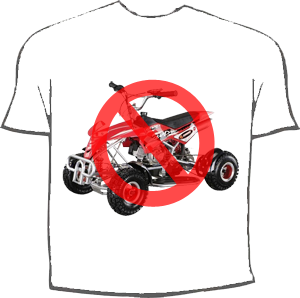

**Aviso para navegantes: entrada escrita con un nivel de cabreo bastante elevado.**

Pues eso, que hoy de buena mañana me enteré que el uso de los quads debería estar penado por ley; son extremadamente peligrosos y no deberíamos poder usarlos. No me entra en la cabeza como podemos ser tan poco concienciados del peligro que corremos cuando nos subimos a todo vehículo móvil que no sea un turismo… ¡hecatombe!

Lo que más me ha gustado de todo es el tío imbécil que ha salido conduciendo un quad mientras entrevistaban a un instructor de vete a saber tú qué, girando la cabeza de un lado al otro, como si fuera en una moto deportiva y estuviera en Cheste… y encima se pone a hacer un derrape, ¡pero será idiota!, ¿así es como se deben conducir correctamente los quads? La madre que me parió, ese tío debería estar amenazado de muerte ya a estas alturas. :S

¿Por qué hostias no prohíben o aconsejan no utilizar, al menos, los guardarraíles? Anoche se mataron dos imbéciles por girar en una rotonda en Madrid haciendo el capullo, y por eso, ya están mal vistos… ¡¿y los guardarraíles qué?! Ellos llevan mil veces más muertes a espaldas, y no pasa nada… Es pasar por la V-30, donde están las obras, y ver que están poniendo otra vez los guardarraíles no homologados de marras y me sale urticaria en el brazo. ¡Cabrones!

Me gustaría que se enteraran los idiotas esos que los peligrosos no son los vehículos, sino los imbéciles que van encima de ello haciendo cosas para las que no están preparadas los vehículos que llevan. Si cuando naciera la gente hicieran un test psicológico y mataran a los que dieran electroencefalograma plano seguro que no pasarían esas cosas; eso sí, el índice de natalidad en España sería nulo.

**¡No a los guardarraíles, basta ya!**
