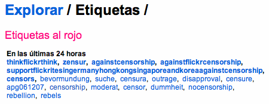

El título de esta entrada es el lema y la frase más sonada estas últimas horas por Flickr. Si no has leído en ninguna parte, ni visto una imagen con este texto es que no estás al tanto de las noticias de Flickr, porque está por todas partes.

Bien, de sobras es conocido el filtro que Flickr pone a las imágenes que ellos consideran poco recomendadas para todos los públicos. Sabemos también que justo debajo del letrero de advertencia hay un botón para, si no es por un descuido, poder decirle que sí quieres verla y entrar a la página de la imagen en cuestión. Bueno, eso es hasta ahora, y sólo en algunos países. A partir de ahora, y desde no sé cuándo, los que en su cuenta pusieran que son de Singapor, Alemania, Hong Kong o Corea no tendrán opción a poder entrar de igual forma a ver la imagen.

Creo que se está cometiendo una injusticia, porque si esa imagen no es válida, no debería ser para nadie, no solamente para la gente de determinados países. Además, ¡la censura acabó hace mucho tiempo!, ¿de qué va todo ésto? No me lo puedo creer. ¿Ahora es que vamos a ser más papistas que el propio Papa? ¡Venga ya!

Yo ya he hecho mi pequeña [colaboración en mi galería](http://flickr.com/photos/wizard_/545080378/). Si dispones de una cuenta en Flickr y quieres unirte contra esta injusticia no dudes en copiar y pegar la imagen, e incluso el texto, y movilizarte para hacernos escuchar por la gente de Flickr.

Además, creo que esta imagen de arriba demuestra el clamor popular, ¿no? Leed los nombres de los tags más populares 

Think Flickr, think!
