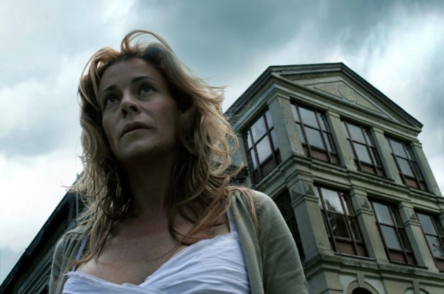

Llevaba tiempo pensando ver **El Orfanato**. No tenía cuándo sería el momento, pero sabía que tenía que verla. La han anunciado a bombo y platillo, y la críticas es muy positiva, así que no debía perdérmela. Máxime cuando a mí las películas de este tipo me encantan.

Al terminar de verla sólo me ha salido una palabra: **olé**. Si [Belén Rueda](http://es.wikipedia.org/wiki/Bel%C3%A9n_Rueda) dejó de hacer Los Serrano para hacer películas como esta, que no vuelva nunca más a hacer una serie, porque de verdad que merece la pena. El final me deja con ganas de más… te deja como diciendo, “_¿ya terminó?_”

No tengo en mente soltar ningún [spoiler](http://es.wikipedia.org/wiki/Spoiler) que pueda fastidiarle la película a nadie, así que no temáis.

Lo que más me ha gustado de todo es la constante comparación que tienen los creyentes en fenómenos paranormales y otros que se basan solamente en lo que dice la ciencia, y como todos sabemos que la ciencia no tiene explicación para esos fenómenos, pues hacen como si no existieran o fueran palabras de gente esquizofrénica o similares… y todos sabemos que así no es. Sin ir más lejos, me recuerda a la inmensa cantidad de debates en el programa Milenio 3 (del que [ya hablé anteriormente](http://fjp.es/2007/07/07/sugestion/)).

Como anotación relativa al tema, meses atrás podíamos enterarnos que en América ya tienen en mente un _remake_ de la película, donde según entendí, la doblarán al idioma de Shakespeare y poco más… ¿y a eso se le llama _remake_ o doblaje? No sé…

El caso es que os recomiendo verla. Personalmente la he visto antes que **REC**, por miedo a que El Orfanato no me gustara después de haber visto la otra… xD
