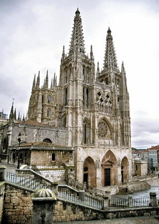

Si todo sale bien y esto sale a la hora prefijada (que supongo que sí) a esta hora justo estaré saliendo de viaje hacia Portugal, la primera etapa de [mi viaje](http://fjp.es/2007/07/12/mis-vacaciones-a-un-mes-vista/) durante una semana sobre dos ruedas. Y me encanta, qué queréis que os diga.

Me alegra más que cualquier otra cosa, pues yo mismo sé qué y cuánto me ha costado que esto, al final, pueda salir. Que si alguien lo duda, ha costado bastante que al final pueda salir bien todo esto. Lo que importa es lo que importa, al final todo salió bien. 

Veré cosas nunca vistas por mí…  
Catedral de Santiago de Compostela

  
Y otras cosas ya vistas, pero que sin duda traerán muy buenos recuerdos…  
Catedral de Burgos

No puedo pedir más: 4000 kilómetros en moto, degustando auténticas maravillas culinarias, viendo paisajes increíbles y rodeado de gente estupenda…

¡Hasta pronto! :D
