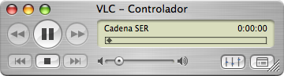

Hacía mucho, pero mucho mucho tiempo (casi desde que tengo un Mac) que llevaba intentando escuchar la Cadena SER mediante el ordenador. Muchos diréis que para qué quiero hacerlo, si en una radio lo tengo fácil. Y bueno, tenéis razón, pero mientras estoy en el ordenador, cuantos menos cacharros tenga cerca, pues más cómodo y más libre me siento.

El caso es que lo había dejado por imposible porque no había forma humana de conseguirlo. El reproductor de la página, cuando le da por funcionar, que rara vez es, va a golpes y después de un determinado tiempo de _inactividad_, según ellos, se para para no colapsar los servidores. Bueno, mentira tras mentira, pero qué se le va a hacer.

Hoy intentándolo ya todo, y hablando con un amigo, me recomendó hacer un [m3u](http://es.wikipedia.org/wiki/M3U) con la dirección y enchufárselo al [VLC](http://www.videolan.org/vlc/) (si no lo tienes, **recomendadísimo bajárselo**). Él no lo había probado, pero me dijo que es una manera viable de que funcionara; que lo probara y le comentara a ver qué tal iba. Dicho y hecho.

Cree un archivo m3u, que no es más que abrir alguna aplicación (la que más rabia nos dé), tipo bloc de notas, y escribir dentro de ella estas líneas:

```
#EXTM3U
#EXTINF:0,Cadena SER
http://195.219.130.201:8017/live
```

Lo guardamos y lo único que tenemos que haces es arrastrarlo a la lista de reproducción de VLC, o bien, click secundario y “abrir con…” y seleccionamos VLC.



Voilà! Ya tenemos la SER reproduciéndose. Eso sí, con un pequeño retraso de, más o menos, medio minuto. Pero bueno, qué más da, ¿no? Al menos, para lo que yo lo quiero, sí me es totalmente igual. Si lo quieres para escuchar la retransmisión de un partido, de fútbol por ejemplo, quizá escuchéis el petardo del gol antes de que lo canten en la radio. 

Personalmente, me encanta [Hablar por hablar](http://www.cadenaser.com/programas.html?anchor=serprohbl) y [Milenio 3](http://www.cadenaser.com/programas.html?anchor=serpromi3). Los que me lleváis siguiendo un tiempo ya lo sabréis. 

\[ayuda\]
