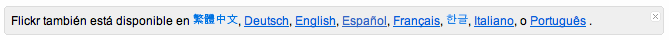

Hace tiempo se comentó que se estudiaría el traducir Flickr a nuestro idioma, entre tantos otros, pero la cosa quedó en el aire. Hace un rato me dio por entrar a Flickr y no iba la página... ¡que raro! pensé... Recargué unas cuantas veces más y tampoco, hasta que al final recargué y vi una imagen que me dio que pensar...

¡Tenemos Flickr traducido al español! Y con una apariencia bastante igualada a la tradicional en el idioma anglosajón.

¿Seré el primero en darme cuenta? :D
