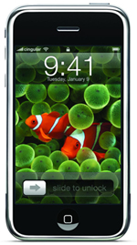

Hasta aquí he llegado, ¡ya no puedo más! Ha llegado un punto en el que me veo el iPhone persiguiéndome en sueños con un cuchillo en… ¿la boca? Al estilo [chucky el muñequito diabólico](http://www.zonalibre.org/blog/parentesis/imagenes/chucky.jpg). Es increíble como un aparato puede hacer y causar todo ésto… ¿o será que no es él? :O

Yo soy fiel seguidor de los productos Apple, pero todo tiene un límite. Desde que Steve Jobs dijo en aquella famosa Keynote que el iPhone era una realidad no se ha hecho más que hablar de él, y cada vez que se acerca el lanzamiento más, y más, y más… ¡argf! Llega el punto de que veas y mires para donde mires ves algo relacionado con el iPhone, son sus peces de colores, o con lo que sea que al final te hace recordar el fantástico cacharrito de la manzanita. Hay que decir que está muy bien, pero no es una maravilla mundial tampoco. Si me lo regalan encantado lo acepto, peor no voy a perder el culo por comprarme uno…

Hemos tenido fakes del iPhone, hemos tenido diferentes precios del iPhone, diferentes tamaños del iPhone, colores, modelos, fondos de pantalla, aplicaciones, posibles futuras versiones, merchandising, fotos robadas de gente usándolo, gentecilla que presume de conocer a Steve y haberle regalado uno, u otros que presumen de tener uno ya en sus manos, tiras cómicas del iPhone \[...\] gente que daría incluso un pulmón por un iPhone, ¡y hasta tangas de iPhone! Bueno, ésto último no, pero seguro que todo se andará, ¿que no?  Y como ésto, un laaaaaaargo etcétera.

Aseguro que mucha gente como yo también está harta, pero muchos de ellos permanecen a la sombra para que no se les tiren al cuello. Probablemente algún día sea usuario de un iPhone, pero joder… todo tiene sus límites, ¿o no?… :S
