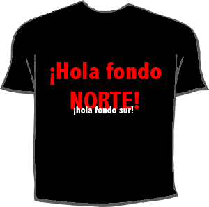

Estaba algo aburrido cuando me ha dado por pensar que, en según qué entradas que vaya haciendo, podría venirle bien una imagen propia de acompañamiento, algo que, aunque sea, consiga hacer un esbozo de sonrisa a aquel que lea las líneas que le precedan.

Estaba pensando en algo original, poco visto; algo casero, y que atraiga… La verdad es que no sé si lo habré conseguido o no, pero el caso es que la idea a mí sí me gusta. Sirve a modo de una frase graciosa acerca de lo que se vaya a leer a continuación, como una especie de resumen extremadamente breve. Creo que puede hacer gracia, si estoy lúcido e inspirado en el momento que me ponga a ello. Lo mejor será un ejemplo práctico, así que vamos allá…

Así es, usaré una camiseta a modo de pancarta, creo que es fácil de hacer, de imaginar, y sobre todo, divertido.

Opinad si gustáis. 
