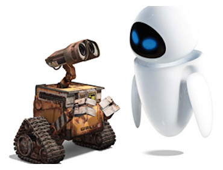

Hace tiempo que no me paso por aquí ni escribo nada, pero esta vez creo que merece la pena. He conseguido un nuevo trabajo, y nada más y nada menos que de profesor de informática en un colegio. Vamos, que no se puede pedir nada más. Ni mejor. Las clases serán con niños pequeños, así que tampoco creo que pueda enseñar gran cosa, ya me preguntaron que _cuándo íbamos a jugar con los ordenadores_… así que no creo que sean unas clases de informática muy completas. xD

Eso sí, el día lo he empezado con buen pie. Aquí ha caído una tormenta de agua torrencial increíble. Tenía que irme con la moto, así que os imaginaréis el panorama. Y cuando parecía ue todo estaba ya demasiado complicaod suena un telefonazo para avisarme que antes de pasar por el colegio debía acudir a otro edificio (más lejos) a recoger unas cuants cosas. De maravilla.

Al llegar al colegio y hablar con unos cuantos profesores me dicen que con esta tormenta no se iban a encender los ordenadores. Y en parte tenían razón porque la luz se estaba yendo cada dos por tres. Así que íbamos a perder más el tiempo que a hacer nada de provecho.

Idea brillante, subirnos todos a una clase, que se estuvieran calladitos, repatir unos cuantos folios y que hicieran lo que les diera la gana. Eso sí, bien claro tener ojo en que no rompan nada. Ya se sabe… xD En fin, tema del día para el dibujo, como habréis podido suponer, [wall-e](http://www.disney.es/FilmesDisney/Wall-E/): el robot de animación de [Disney-Pixar](http://www.disney.es/) (toque Mac a los chiquillos, que hay que ir adoctrinando). xD

En fin, a ver qué sucede en los próximos días, porque ni siquiera sé si me darán algún temario que seguir, apuntes, o qué carajo tendré que enseñar a los nanos. Me da que con lo inquietos que son a final de curso habremos aprendido a crear una carpeta y poco más, como me comentó mi colega [memb](http://membrive.es/) (por cierto, blog un poco abandonado, casi tanto como el mío). :D
