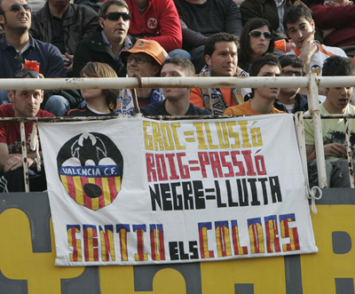

Este fin de semana, aparte de jugarse un partido de fútbol **debía cobrar una venganza**. Y se cobró. Los sevillanos salieron del campo del Valencia CF **tocados y hundidos**. Después de que nos eliminaran de la Copa del Rey tras un partido repleto de errores arbitrales debíamos humillarlos lo máximo posible, y si nos dejan unos minutos más les cae el cuarto. ¡Vaya si les cae! A ver si aprenden que esto es fútbol y no baloncesto. xD Y que no pueden marcarse goles estando 3 ó 4 metros en fuera de juego. **Patéticos**.

El caso es que además de eso el [Valencia CF](http://www.valenciacf.com) había promovido un [concurso de pancartas](http://www.valenciacf.com/contenidos/Actualidad/Noticias/2009/04/Noticia_18301.html?__locale=es), amén de realizarse el **precioso tifo** que se realizó. La que se ve al inicio de este artículo es la que, personalmente, más me gustó de todas. Aunque no es la que ganó. La que ganó no fue demasiado estética ni bonita, pero estaba _de moda_ por el texto que en la pancarta podía leerse: **CHE, we can**.

En fin, los próximos partidos que nos quedan debemos estar a la altura de este último. Debemos quedar este año terceros a toda costa. Llevándonos por delante a quienes tengamos que llevarnos. Matando si hace falta… xD perdón, me dejé llevar por la situación. 

**¡AMUNT VALÉNCIA!**
