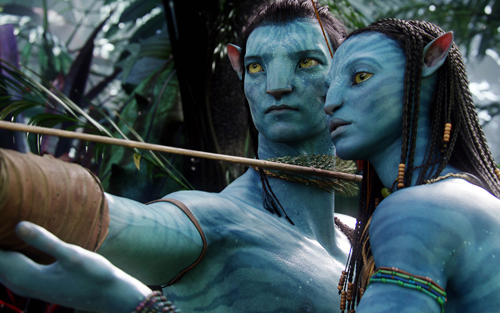

### Puntuación

**Intérpretes**

    

**Innovación**

    

**Reparto**

    

**Duración**

    

**Objetivo**

    

**Impresionante, espectacular, magnífica, grandiosa, majestuosa, sublime**... No se me ocurren otras palabras que dedicarle a esta película que esas; es lo mejor que he visto en la pantalla grande desde hace mucho tiempo. [James Cameron](http://www.imdb.es/name/nm0000116/) estaba ya cubierto de gloria, pero de ahora en adelante y tras haber hecho esta obra de arte no se puede esperar nada más ni mejor de él. Increíble, en serio.

La película narra la historia de **Jake Sully** ([Sam Worthington](http://www.imdb.es/name/nm0941777/)), un marine veterano herido en combate que reemplaza a su hermano gemelo, idéntico genéticamente, en el proyecto **Avatar**. Tras aceptar el empleo, junto a otros más, es llevado al planeta **Pandora**; planeta habitado por unas criaturas humanoides con su propia lengua y cultura llamados **Na'vi**. Allí estará a las órdenes de la **Doctora Grace Augustine** ([Sigourney Weaver](http://www.imdb.es/name/nm0000244/)) y, secundariamente, del **Coronel Miles Quaritch** ([Stephen Lang](http://www.imdb.es/name/nm0002332/)).

La misión se centra únicamente en la **avaricia** y **codicia** humana, ya que en **Omaticaya**, clan en el que se basa la película, existe una ingente cantidad de un material llamado **unobtainium**, un mineral que en el Planeta Tierra tiene una venta a un nivel económico escandaloso.

Para conseguir la máxima cantidad de **unobtainium** posible **Jake Sully**, junto a la **Doctora Grace Augustine** y **Norm Spellman** ([Joel Moore](http://www.imdb.es/name/nm0601376/)), manejan remotamente un cuerpo artificial (los avatares) creado para que se asemeje lo máximo posible a la estructura física de los nativos de **Pandora** y que, de ese modo, éstos confíen más en ellos. **Jake Sully** tendrá que valorar qué hacer: guiarse por la cabeza y aniquilar el planeta matando y exterminando la raza **Na'vi**, o guiarse por el corazón y, desde su avatar, unirse a los **Omaticayas** y defender **Pandora**.

Durante la película, y gracias a escuchar las palabras de los **Omaticayas**, nos enseñan a apreciar más el medio ambiente que nos rodea: el agua, las plantas, el aire, los animales... que tan _de moda_ se ha puesto ahora con el tema de **Greenpeace**, el cambio climático y todas esas cosas sobradamente conocidas por cualquiera que viva en este planeta.

Me abstengo de contar más detalles la película porque todavía está de estreno y sería fastidiar a quienes puedan leerme. Sólo añadir una cosa más: **LA RECOMIENDO ENCARECIDAMENTE**; casi tres horas de película que, cuando terminas de verla, querrías que durara cinco horas.
