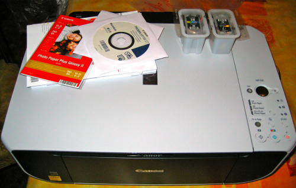

Como dije [por Twitter](http://twitter.com/wizard/status/1811153937) se me estropeó la impresora; y bueno, viendo la suerte que he tenido yo tanto con impresoras como son escáneres no se ha portado mal, porque la tendré desde el año 2004 ó 2005.

El caso es que es una de las cosas que más uso por mi trabajo. Siempre tengo que imprimir cosas. Si no, también imprimo mucho material para el motoclub o cosas personales. El caso es que la uso muchísimo. Sin impresora iba a estar manco.

Pues bien, aunque no me lo esperaba, desde hoy tengo nueva impresora donde poder disfrutar. Y no sólo impresora, si no que es una multifunción. Es la primera que tengo y tiene una pinta de escándalo. Se trata de la **Canon PIXMA MP190**; como Canon sea tan buena marca en impresoras multifunción como lo es en cámaras fotográficas, ya puedo estar contento.

Las primeras impresiones son excelentes. La antigua **HP Deskjet 3820** que tenía era lentísima a la hora de ir sacando las copias, y esta en comparación vuela. Además ha hecho una fotocopia de un DNI para probar y las copias también van muy rápidas. Y a la hora de escanear, la calidad también es bastante buena. Así que de momento, de cine.

Algo que me ha gustado mucho es el soporte al cien por cien para Mac. Viene con el CD para Mac y en el propio manual de instrucciones están separadas la forma de instalar la impresora en Mac y Windows; que aunque más o menos pone lo mismo, pero me gustó que estuviéramos separados los usuarios de la manzanita. 

En fin, a hacer copias como loco. Espero que me dure más que las anteriores que, sobre todo los escáners, me han salido malísimos (ambos HP).
