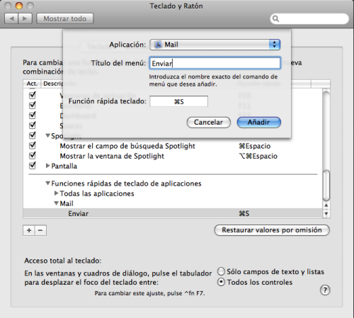

[Un Tweet](http://twitter.com/MiguelOSX/status/1727874678) de [Miguel](http://mdelhoyo.com) de esta tarde me llevó a pensar lo que había hecho hace un par de días. Y es que si existe algún atajo de teclado para enviar un correo en [Apple Mail](http://www.apple.com/es/macosx/features/mail.html) lo desconozco, pero **yo me creé el mío propio**. Y es muy fácil de hacerlo, tanto con la aplicación **Apple Mail** como con cualquiera de las que tengas instaladas en tu **Mac**.

Sólo debes irte al **Panel de Preferencias** – **Teclado y ratón** – **Funciones rápidas de teclado**. Ahí le damos al botón de **+** y saldrá la ventana que pongo en la imagen que inicia este artículo.

Como se puede ver, sólo hay que indicar a qué aplicación queremos añadir el atajo de teclado, escribir el nombre del comando que queremos ejecutar (en mi caso “Enviar”) y asignarle el atajo deseado. Bien rápido, fácil y cómodo.

Cosas como esta es la que hacen que me encante Mac. :D

\[ayuda\]
