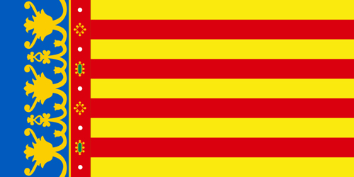

Hoy, 9 de octubre, se celebra el día de la Comunidad Valenciana. Se conmemora la entrada a Valencia del Rey Don Jaume I en 1238. 
Es un orgullo para todos nosotros pasar por este día, disfrutar de todos los actos que se celebren y, en definitiva, conmemorar lo que aún hoy somos: cap i casal de l’antic Regne de Valéncia.

**¡VIXCA VALÉNCIA!**
