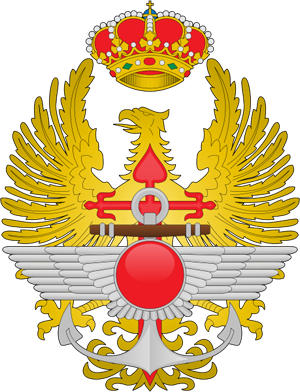

Este fin de semana se celebraba en Santander el día de las **Fuerzas Armadas Españolas**. Y desde aquí quiero hacer un homenaje a todas esas personas que, por una razón u otra, se pasan la vida trabajando para estar ahí si algún día necesitáramos de su ayuda.

**Están tanto en catástrofes naturales** como puedan ser incendios, inundaciones, terremotos… **como, por supuesto, ahí estarán para derramar la sangre por su país si un día** (Dios no lo quiera) **el país entrara en guerra**. **Tenemos uno de los mejores ejércitos**, avalados por cientos y cientos de condecoraciones y honores que poseen nuestros soldados, y es una de las cosas de las que más orgullosos podemos sentirnos los españoles.

Desde aquí no puedo mas que dar las gracias a todos ellos por estar ahí siempre que se les ha necesitado. En Valencia mismamente por tema de inundaciones, derribos de puentes dejando incomunicados algunos pueblos y demás, **siempre hemos podido contar con su inestimable ayuda**. **Y eso es muy de agradecer siempre**.

Sin más, ¡bravo!
