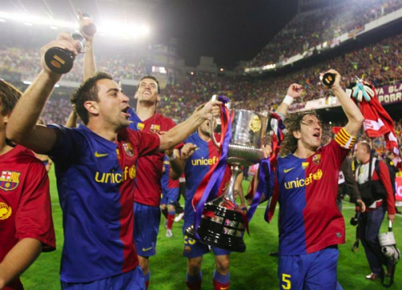

Sólo quería felicitar a los aficionados culés por la victoria conseguida, pero no estaría siendo consecuente conmigo mismo si no añadiera que para nada quería que ganara esta Copa del Rey el FC Barcelona. Y mucho menos siendo en Mestalla.

En cuanto a la afición del Athletic, chapó. Animando desde el principio al final, con un par de cojones. Como dirían ellos: **¡Athletic txapeldun!** Para qué negarlo, me hubiera gustado que fueran ellos quienes la hubieran ganado. Pero qué se le va a hacer, así es la vida. Se ha perdido contra el mejor equipo de España actualmente (de Europa aún está por ver). 

También quiero hacer mención a ambas aficiones a la hora de sonar el himno de España, que aunque ya se sabía lo que iba a pasar DIO PENA. Es de vergüenza que ESPAÑOLES renieguen de su propio himno, y ya no eso, si no la de improperios que le soltaron al Rey de España. Sentí vergüenza ajena de ver un montón de cenutrios sacados de sí mismos perdiendo el control y las formas, y dejando a toda la afición de ambos equipos a la altura del betún cuando durante todo el partido habían estado impecables. Lamentable. Si no quieren saber nada de España y de su himno lo más fácil es que no disputen un trofeo que, como bien dice su nombre, es de S.M. el Rey y, por ende, DE ESPAÑA.

Odio a esa gente…

**Edito:** ya de paso, hacer extensiva la felicitación por la Liga… A este paso me toca editarlo una vez más. xD
