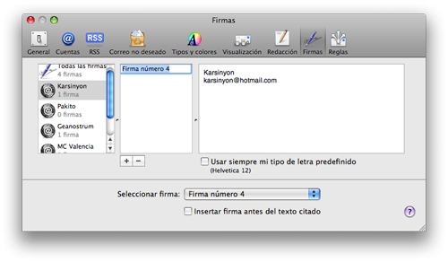
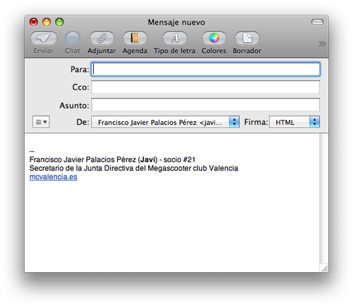

A partir de OS X 10.8 Mountain Lion el proceso cambia. Sólo sigue leyendo este tutorial si tienes una versión del sistema operativo anterior, si no sigue este tutorial: [Firmas HTML en Apple Mail (Mountain Lion).](http://fjp.es/firmas-html-en-apple-mail-nuevo-metodo/)

Hoy he necesitado añadir una firma con formato HTML en Apple Mail y a simple vista no se podía, pero realmente sí se puede. Tras pegar un vistazo en Google he dado con la solución y la pongo aquí por si alguien más estuviera interesado en ello y a modo de recordatorio para futuras ocasiones en las que necesite crear una nueva firma con formato HTML para nuevas cuentas de correo electrónico.

El proceso es sencillo pero, como todo, hay que saber cómo hacerlo. Lo que no entiendo es como Apple no ha pensado que sus usuarios querríamos poder tener la posibilidad de meterle código HTML, CSS o al menos BBCODE a nuestras firmas. Aunque yo no soy de utilizarlo, sólo con que necesites poner un logo en la firma ya tienes que recurrir a ello. Y es algo muy básico y frecuentemente utilizado… En fin… ¡Vamos allá!

### Creando nuestra firma en HTML

Lo primero es abrir un editor de textos y crear nuestra firma en HTML. Podremos poner también incrustado en las etiquetas HTML estilos CSS para hacer todavía más personal nuestra firma. Donde hay que prestar atención es en las imágenes que queramos insertar, pues no se enviarán con el correo. Así que **tendremos que alojarlas en algún servidor** y **añadir la ruta completa de la imagen**. Si no disponemos de ninguno se pueden utilizar servicios gratuitos como [ImageShack](http://imageshack.us) teniendo siempre en cuenta el asegurarse de que la imagen sigue existiendo cuando se vayamos a enviar nuestros correos. Cuando lo tengamos guardamos el archivo **con extensión .html** y vamos al siguiente paso.

### “Engañando” a Mail para que acepte nuestra firma

Como dije al principio Apple no ha pensado en la posibilidad de que quisiéramos adjuntar una firma con código HTML en nuestras firmas, así que hay que “engañarle”. Para ello debemos tener una firma ya creada, si no tendremos que crear una. Nos vamos a las **preferencias de Mail** y de ahí a la **sección de firmas**. Por defecto Mail nos pone como firma (al crearla) nuestro nombre y nuestra dirección de correo electrónico. Podemos dejar esa mismo, total, no va a servir para nada. xD

Ahora **desde Safari abrimos el archivo HTML que habíamos creado** con anterioridad. Nos vamos al menú de archivo, guardar como… (podemos utilizar el atajo de teclado cmd+s) y **elegimos el formato Archivo Web**.  

Lo bueno que tiene Mail es que todas las firmas las guarda en este formato. Por tanto, cualquier archivo de texto puede ser exportado y Mail lo reconocerá como un archivo de firmas normal y corriente y tras ser exportado tendrá el mismo formato que le dimos a la firma HTML.

**Cerramos Mail** (importante este dato).

- **Si tienes Mac OSX Lion:** nos vamos a la **carpeta de nuestro usuario** (en mi caso Javi)  de ahí nos vamos a **Librería**, **Mail**, **V2**, **MailData** y **Signatures**.
- **Para anteriores versiones:** nos vamos a la **carpeta de nuestro usuario** (en mi caso Javi)  de ahí nos vamos a **Librería**, **Mail** y **Signatures**.

Si solamente hemos creado una firma lo tendremos fácil, si no para saber cuál es el archivo que pertenece a la firma que queremos cambiar podemos **abrirlo desde Safari** y comprobarlo. Cuando lo tengamos claro le damos a **cambiar nombre del archivo**, lo seleccionamos todo y lo copiamos. Ahora nos vamos al archivo que hemos exportado a formato Archivo Web desde Safari (el que contiene la firma que realmente queremos tener), le damos a cambiar el nombre y pegamos lo que teníamos en el portapapeles. Así **hemos creado un archivo con nombre idéntico**. Lo **arrastramos a la carpeta donde están las firmas de Mail**, reemplazamos, abrimos Mail y… ¡alehop! Ya tenemos firma.

### Nota final

Si nos vamos a las preferencias de nuevo y al apartado firmas tendremos también ahí nuestra preciosa firma con formateado HTML. No podremos cambiar los enlaces que hayamos podido crear ni ningún carácter de HTML, pero dentro de lo que es el texto si nos hemos equivocado en algo sí podremos corregirlo. Vamos, una edición leve, si queremos modificarla totalmente tendríamos que volver a repetir el proceso.

Como siempre, dudas, comentarios, etc… aquí estoy.

A partir de OS X 10.8 Mountain Lion el proceso cambia. Sólo sigue leyendo este tutorial si tienes una versión del sistema operativo anterior, si no sigue este tutorial: [Firmas HTML en Apple Mail (Mountain Lion).](http://fjp.es/firmas-html-en-apple-mail-nuevo-metodo/)

\[ayuda\]
