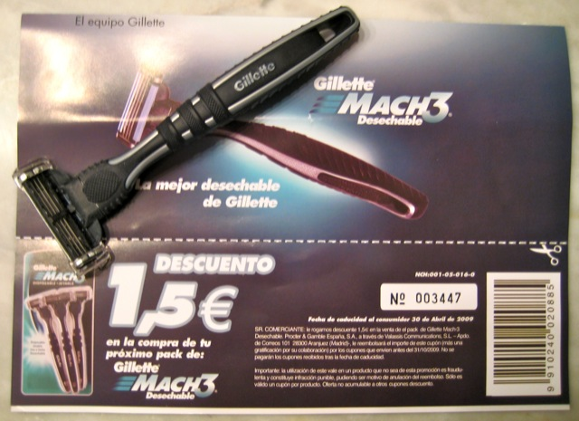

Quiero destacar primero que por esta entrada no estoy recibiendo remuneración alguna. Simplemente lo hago porque me apetece destacar lo buen que funciona esta cuchilla. Totalmente voluntario.

Hace tiempo (no recuerdo cuánto) no sé dónde vi que [Gillette](http://www.gillette.com/es-ES/) había sacado una nueva cuchilla y que se podía pedir una muestra gratuita desde la ya inexistente página lanuevamach3desechable.com. Supongo que al finalizar la promoción la habrán quitado. El caso es que como gratis que era me lancé y la pedí. Pensaba que al pasar tanto tiempo (calculo a ojo que sobre un mes, aunque no lo sé cierto) ya no me la enviarían, de hecho ni siquiera me acordaba.

El viernes creo que fue me llegó un sobre al buzón, y en efecto era la cuchilla. Sinceramente, nunca he sido de gastarme mucho dinero en cuchillas porque pensaba que era indiferente y que para la función que hacían cualquiera serviría. Estaba equivocado. Siempre he padecido de tener la piel muy sensible, y tras un afeitado y sobre todo cuando hacía muchos días que no me afeitaba se me irritaba la piel y solía escocerme bastante.

Además de regalarme la cuchilla envían un folleto en el que, en su parte inferior, tienes un **cupón descuento** de 1,5€ para la próxima compra de **Gillette Mach3 desechable**.

Y lo dicho, que me he afeitado con ella y ha sido una pasada. Rápido, sin apenas pasadas, sin irritaciones… de maravilla. Ahora a ver cuántos afeitados duran las hojas, y dependiendo de eso lo mismo hasta me animo y me cambio de cuchillas. La verdad es que de momento me han convencido.
