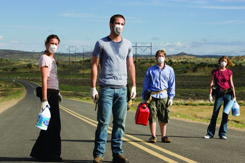

Recordando [la crítica que hice ayer a \[REC\]2](http://fjp.es/rec-2/), ésta sí. Aunque entiendo que por el título no podría ser de otra forma, ésta sí es una película de **infectados**, sin mezclar posesiones ni historias raras.

Lo que en principio comienza como previsible va convirtiéndose en interesante según pasa la película. Tanto, que en mi opinión, hasta llega a hacerse corta. Sobre todo por ese final tan… tan…, pero de eso hablaré luego. Lo primero, destacar la interpretación de [Chris Pine](http://www.imdb.es/name/nm1517976/), con el papel de **Brian** en la película: hermano mayor de **Danny** ([Lou Taylor Pucci](http://www.imdb.es/name/nm1086384/)) y novio de **Bobby** ([Piper Perabo](http://www.imdb.es/name/nm0005305/)). Hay que destacar que, pese a que la película está rodada íntegramente en Estados Unidos, y que sus actores también son americanos, sus dos directores son los españoles (y hermanos) [Álex](http://www.imdb.es/name/nm1883612/) y [David Pastor](http://www.imdb.es/name/nm0665041/).

Si hay algo que me gusta de esta película es que los **infectados** no tienden a salir corriendo para tirarse al cuello de los demás para infectarlos, como si se tratara de un vampiro en lugar de un infectado. O quizá un zombie. Aquí contraen el virus, sea de la forma que sea, y poco a poco van muriéndose… pero ni mutan a un ser extraño, ni se hacen más agresivos, ni nada así. En esta película los verdaderamente agresivos son los humanos que todavía no están **infectados**. Y eso me gustó. Para gustos… ya se sabe.

Poco más que decir, que para mí, es una buena película teniendo en cuenta el género que es, y para el público que es.  
La recomiendo.
