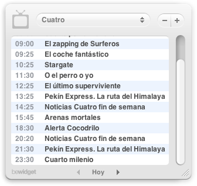

Si sois de los que, como yo, siempre queréis estar al tanto de qué hacen en la televisión -por si hay algo interesante que ver-, utilizáis un Mac y tenéis especial interés por su Dashboard y los widgets, seguro que conoceréis el widget [laTele](http://www.bewidget.com/widget/latele). Para quien no lo conozca, se trata de un widget en el que se puede ver la parrilla de programación de todos los canales de televisión de España; incluyendo canales de TDT y regionales.

Hace un tiempo que, misteriosamente, dejó de funcionar. Así que entré a su página y le expuse el caso a su autor desde la zona de contacto. Por si acaso no se había dado cuenta. Bien, muy amable me contestó diciéndome que buscaría la forma de resolverlo y que cuando hubiera una nueva versión me avisaría para que pudiera seguir disfrutando del widget. Y así ha sido. Hoy recibí un correo suyo en el que me indicaba que el error había sido reparado y el enlace para descarga directa de la nueva versión. Si el widget ya merecía la pena, ahora sabiendo la atención que el autor pone en sus usuarios aún la merece más. Y es por eso por lo que os lo recomiendo a todo el mundo.

Ya me diréis qué os parece si no lo conocíais todavía. 

- Página del creador: [beWidget](http://www.bewidget.com) (hay más widgets disponibles).
- Sección del widget laTele: [beWidget/laTele](http://www.bewidget.com/widget/latele).
- Descarga directa del widget laTele: [descargar laTele](http://www.bewidget.com/download/latele).
