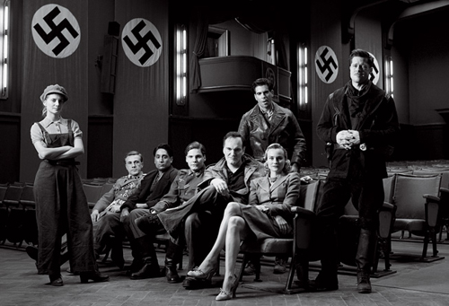

### Puntuación

**Intérpretes**

    

**Innovación**

    

**Reparto**

    

**Duración**

    

**Objetivo**

    

**Malditos Bastardos** era una película que esperaba ver con ganas. Tanto por el elenco que interpreta los distintos personajes como por su director, [Quentin Tarantino](http://www.imdb.es/name/nm0000233/). La película no puede decirse que esté mal, porque no lo está, pero sí puedo asegurar que es otra cosa bien distinta a lo que se vendía de ella con los distintos avances y tráilers que se han emitido previo estreno. Al menos yo esperaba ver a _los bastardos_ asesinando, masacrando y mutilando nazis mucho más tiempo de lo que en realidad estuvieron; **eso es lo que nos vendían en los tráilers**. Aunque quizá se basaron en los veinte minutos aproximados en los que vemos algo de acción real en la película para hacer los tráilers… y siendo una película de dos horas y media, pues quizá y sólo quizá, hayan vendido algo que no han hecho. Si el objetivo de la película era que disfrutáramos viendo como nueve judíos masacraban a todo el batallón alemán del Tercer Reich y al Führer no lo han conseguido. Y por lo que dan a entender, sí era ese.

Pasemos a lo que es la película en sí, que como dije, tampoco está mal. Aunque no fuera lo que me esperaba. Tenemos un buen elenco de actores para la película, no se podía esperar menos de **Tarantino**. Como máximos exponentes tenemos a [Brad Pitt](http://www.imdb.es/name/nm0000093/) con el papel de **Aldo Raine** (quien alista a los bastardos) y su séquito: **Donny Donowitz** ([Eli Roth](http://www.imdb.es/name/nm0744834/)), **Archie Hicox** ([Michael Fassbender](http://www.imdb.es/name/nm1055413/)), **Hugo Stiglitz** ([Til Schweiger](http://www.imdb.es/name/nm0001709/)), **Wilhelm Wicki** ([Gedeon Burkhard](http://www.imdb.es/name/nm0121972/)), **Smithson Utivich** ([B.J. Novak](http://www.imdb.es/name/nm1145983/)), **Omar Ulmer** ([Omar Doom](http://www.imdb.es/name/nm2374829/)), **Gerold Hirschberg** ([Samm Levine](http://www.imdb.es/name/nm0505949/)), **Andy Kagan** ([Paul Rust](http://www.imdb.es/name/nm1770256/)) y **Michael Zimmerman** ([Michael Bacall](http://www.imdb.es/name/nm0045209/)). Aunque no podemos dejar a un lado a otros como [Mélanie Laurent](http://www.imdb.es/name/nm0491259/) con el papel de **Shosanna Dreyfus**, a [Diane Kruger](http://www.imdb.es/name/nm1208167/) interpretando a **Bridget von Hammersmark** o a [Martin Wuttke](http://www.imdb.es/name/nm0943487/) encarnando al mismísimo **Adolf Hitler**.

La ambientación de la película desde el inicio es genial. Me encantó. Los extensos diálogos propios del director, **Quentin Tarantino**, es algo que se esperaba, pero que en ocasiones pueden resultar algo tediosos (las menos). Algo que no me gustó demasiado fue la Banda Sonora, y es que no sé por qué extraña razón me recordaba a otra película… Un fallo que vi es que cuando el Führer va paseándose por ahí, o cuando está en el cine viendo la película (una osadía pensar que eso fuera a ocurrir, por otro lado), la escolta que llevaba era irrisoria; en caso de haber sido cierto, llevaría él sólo más escolta que todo el ejercito que salió en la película… Son detalles que se deberían mejorar en una película dirigida por quien está dirigida.

La interpretación de todo el elenco es excepcional. La forma de tratar las escenas, el cuidado de los detalles, etc… Aunque, como dije al principio, seguro que me hubiera gustado más y me hubiera decepcionado menos si hubiera sido lo que se prometía en el tráiler: un grupo reducido de judíos matando nazis a diestro y siniestro. Dos horas y media de película dan para mucho más que, a lo sumo, veinte minutos de acción real.
