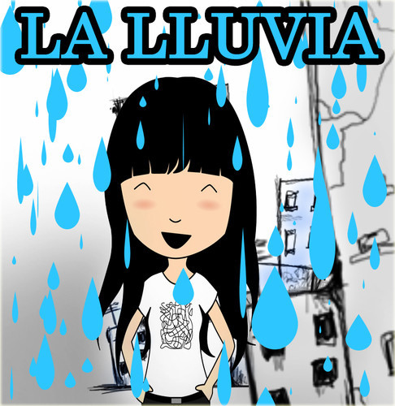

Hacía demasiado tiempo que no me ponía moñas poniendo alguna canción que, por un motivo u otro, me guste. Como siempre, con la letra, que realmente es lo que me gusta de las canciones que pongo aquí. Quizá, y sea el caso, me recuerden cosas pasadas que no deberían siquiera estar en mi mente, pero qué vamos a hacerle, esta vida es así. Así de puta, vaya.

\[youtube 9LVpzRt2s5Y\]

> Llueve, y las aceras están mojadas. Todas las huellas están borradas. La lluvia guarda nuestro secreto...
> 
> Llueve, y en mi ventana te echo de menos, los días pasan y son ajenos, el frío me abraza y me parte en dos...
> 
> La lluvia cae sobre los tejados, donde fuimos más que amigos. Recuerdo que dormimos al abrigo del amanecer...
> 
> Los bares han cerrado ya no hay copas. La lluvia hoy mojará mi ropa. Si no estás aquí... Si tú no estás me duelen más los años, las heridas me hacen daño, si no vuelvo a oír tu voz...
> 
> Llueve, y las palabras se quedan mudas, todas las noches las mismas dudas... ¿Qué fue de todos aquellos besos?
> 
> Llueve, y se enmudece la primavera. Cuento las veces que el sol espera, para secar de lluvia la acera, para secar de lluvia el tejado donde fuimos más que amigos. Recuerdo que dormimos al abrigo del amanecer...
> 
> Los bares han cerrado ya no hay copas. La lluvia hoy mojará mi ropa. Si no estás aquí... Si tú no estás me duelen mas los años, las heridas me hacen daño, si no vuelvo a oír tu voz... si no vuelvo a oír tu voz...
> 
> En los tejados donde fuimos más que amigos... Recuerdo que dormimos al abrigo del amanecer...
> 
> Los bares han cerrado ya no hay copas. La lluvia hoy mojará mi ropa. Si no estás aquí... Si tú no estás me duelen mas los años, las heridas me hacen daño, si no vuelvo a oír tu voz...
> 
> Si no vuelvo a oír tu voz...

Pues... eso. :)
