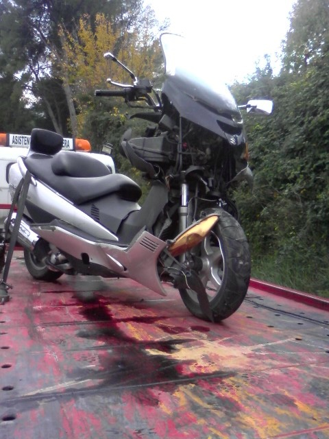
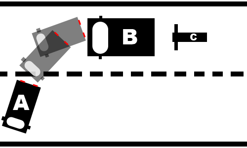

Sé que no dije nada por ningún lado en su día, pero quería esperarme para ver cómo acababa toda _esta película_ para escribirlo todo como debía escribirse: de principio a fin. La fotografía que veis arriba será el último recuerdo que tendré de mi vieja moto, de mi vieja **Suzuki Burgman 400**.

El sábado día doce de diciembre me dispuse a ir, como casi todas las semanas, al Mercadona de un pueblo que tengo al lado a comprar algunas cosas que, de lejos, están mucho más baratas que en las tiendas que tenemos aquí. Cuando tiré a arrancarla, la moto no iba... parecía no querer arrancar ni salir ese día a la carretera; quién sabe si sería algún tipo de señal, aunque no creo en esas cosas. Conseguí arrancarle y llegué a mi destino. Hice la compra que tenía que hacer y regresaba hacia mi casa... cuando un energúmeno en una recta parecía no saber hacia dónde iba y nos involucró a todos en un accidente en el que, qué casualidad, el peor parado fui yo.

No sé bien si se apreciará en el _croquis_ que puse arriba lo que quiero expresar en él, pero me servirá de ayuda para que comprendáis lo que pasó. Bien, circulábamos por una vía recta a unos 70km/h aproximadamente; el coche **A** vio que se pasaba un desvío no asfaltado por donde debía haberse metido, y en lugar de aminorar la velocidad, arrimarse al arcén y, cuando no venga nadie, dar la vuelta y meterse... frenó en seco y pegó volantazo para incorporarse. Como efecto secundario, el vehículo que iba tras él (vehículo **B**) tuvo que frenar también muy bruscamente para tratar de detenerse en seco y no chocar contra el coche del loco ese... éste se quedó muy próximo al vehículo **A**, pero no llegó a colisionar apenas con él. Yo, vehículo **C**, circulaba con mi moto a los mismos 70km/h, pero en una moto son más difíciles de parar en seco: intenté frenando con mi freno trasero (que incorpora frenada dual) sin resultado alguno, utilicé el delantero manualmente y, estando nervioso, fue en vano porque le di más de la cuenta y la moto ya derrapaba sobre las dos ruedas mientras seguía avanzando sin control...; intenté desviar mi trayectoria para no impactar directamente contra el vehículo **B**, pero no hubo manera...

El resultado de todo esto, añadiendo que el vehículo **A** cuando se dio cuenta de lo que había pasado abandonó el lugar rápidamente, fue que tras mi brutal impacto contra el vehículo **B** salí despedido de la moto ocasionándome un corte en el labio, al impactar contra los dientes, las dos rodillas tocadas, un desgarro muscular a la altura de las costillas derechas, un esguince en ambas muñecas y una leve contusión en la frente. Todo esto, teniendo en cuenta que unos chicos que vieron como tenía el accidente me dijeron que habían visto a gente con menos caída que la mía que se habían quedado en el acto. En fin...

En cuanto a la moto, es de risa, como la reparación de la misma supera su valor actual... y tras unos cuantos chanchullos que me han hecho con tal de aprovecharse de mí y ganar dinero a mi costa... en el desguace que más dinero me dan por ella alcanza la desorbitada suma de cuatrocientos euros (400€). Hoy se firmó su baja y su despedida como moto de dos ruedas, después algo más de cinco años haciéndome disfrutar montado encima de ella de miles y miles de kilómetros...

Con ella se me han ido, por ahora, las dos ruedas en las que montaba casi todos los días; me quedé sin moto. Y todo por culpa de ese cabrón que, cuando se lo vio jodido, se fue sin dejar rastro y sin que a nadie le diera tiempo a reaccionar y acordarse de su matrícula.

Te echaré de menos.
