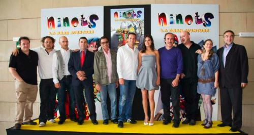

Ya tenía yo ganas de una película que _barriera para casa_, hombe. Ayer fue la presentación oficial de esta película en la que seis _ninots_ de falla descubren que su finalidad es acabar devorados por las llamas, por lo que iniciarán una aventura en la que recorrerán la ciudad de Valencia con tal de encontrar al artista fallero que les desvele como pueden salvarse de su destino. Para rematar faltaba que la película tuviera una versión en valenciano. Ya sería la leche.

**Sergio García**, golfista valenciano, y **Jorge Martínez _Aspar_**, ex piloto de motociclismo, apadrinaron la presentación de **Ninots**. Lugar donde también se dieron cita el humorista **Pedro Reyes**, **Iris Lezcano** y **Carmen Juan**, actores de la serie de [Canal Nou](http://www.rtvv.es/) **L’alqueria blanca**, que pondrán la voz a los distintos personajes del largometraje. Y que a su vez presentaron la película junto con **Manuel García**, director, y **Ximo Pérez**, productor de la empresa [Trivisión](??http://www.trivision.es).

Con un presupuesto de cinco millones de euros, Ximo Pérez ha anunciado que la película **ha despertado un gran interés dentro del mundo fallero y su aceptación ha sido maravillosa**.

Es el primer largometraje de animación que tendrá como protagonistas a _ninots_ de falla. Pretendemos que sea una película que no solo pueda funcionar muy bien en las taquillas españolas sino también a nivel internacional

Sólo me queda desearles la máxima de las suertes en este proyecto que **verá luz en 2011**. Hasta entonces, espero que cunda el trabajo y que realmente salga una película de animación que expanda la cultura valenciana tanto por España como por aquellos países donde quiera que llegue. Ya se sabe, las Fallas son mundialmente conocidas. Y eso es así.

¡Mucha suerte! Y **gracias en nombre de un valenciano más**.
