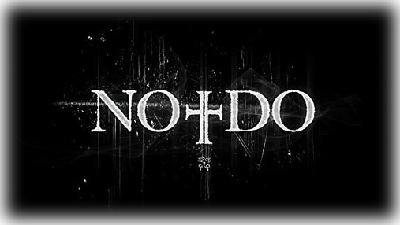

### Puntuación

**Interpretes**

    

**Innovación**

    

**Reparto**

    

**Duración**

    

**Objetivo**

    

Hace tiempo que había escuchado el estreno de esta película. Incluso, si no recuerdo mal, en **Cuarto Milenio** se comentó. Pero hasta ahora no había caído en verla; tampoco sabía cómo sería ni nada. Ayer recibí una recomendación de la película. Entré en su página web: [No-Do, the movie](http://www.nodothemovie.com), visualicé el tráiler y quedé fascinado. No pude hacer otra cosa que ir rápido a verla.

Empecemos con el reparto: genial. Todo _made in Spain_. Con los papeles principales tenemos a la más que conocida [Ana Torrent](http://www.imdb.es/name/nm0868479/) interpretando el papel de Francesca; a [Francisco Boira](http://www.imdb.es/name/nm0092286/) con el papel de Pedro, marido de Francesca; también a [Héctor Colomé](http://www.imdb.es/name/nm0173105/), psiquiatra, sacerdote y miembro de la Congregación para las Causas de los Santos. También forman parte del reparto otros como [Rocío Muñoz](http://www.imdb.es/name/nm0616503/), [Francisco Casares](http://www.imdb.es/name/nm0142983/), [Miriam Cepa](http://www.imdb.es/name/nm1967352/) y muchos más.

Pater noster, qui es in caelis, sanctificetur nomen tuum. Adveniat regnum tuum. Fiat voluntas tua, sicut in caelo, et in terra. Panem nostrum quotidianum da nobis hodie, et dimitte nobis debita nostra sicut et nos dimittimus debitoribus nostris. Et ne nos inducas in tentationem, sed libera nos a malo. Amen.

La película trata sobre aquellos **No-Do**s (noticiarios documentales) que se emitían en los cines antes de que empezaran las películas. Aunque estos no son los que nos ocupan, ya que ahora mismo a poca gente interesaría. Los que nos ocupan son los llamados **No-Dos secretos**: que son unas grabaciones confidenciales realizadas por el Régimen Franquista para la Iglesia Católica en los años 40 y 50 documentando fenómenos milagrosos, apariciones marianas, prodigios y sucesos parapsicológicos. Aunque como dicen en la película: **NO TODOS LOS MILAGROS SON BUENOS**.

Narra la historia de una pareja: Francesca y Pedro, que tras haber traído al mundo a su último hijo deciden buscarse una casa retirada de la ciudad para que el nivel del vida del pequeño sea mayor. Encuentran una enorme casa que pertenecía a un sacerdote que muró y que la Iglesia ha decidido alquilar. Aunque lo que no esperan es que esa casa tuviera una historia que haría que sus días se convirtieran en una pesadilla. Y aunque el escenario esté demasiado visto por otras películas: un caserón enorme, viejo y polvoriento, fantasmas, ruidos, etc… [Elio Quiroga](http://www.imdb.es/name/nm0004439/) sabe darle un toque especial que hace que no te recuerde a nada de lo anteriormente visto.

Los efectos especiales de la película, el post-proceso y 3D, son de una calidad sublime. La película ha sido realizada en su totalidad de forma digital para darle un realismo y una calidad difícil de superar en una película de este tipo y con el escaso presupuesto que suelen tener estas películas comprándolas con las producidas en Estados Unidos.

Personalmente, me enganchó hasta el final. La habría hecho durar, por lo menos, una horita más.
