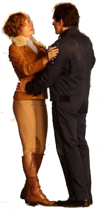

Ya que había visto **Noche en el museo** al salir **Noche en el museo 2** quise verla. Y así ha sido. No es que la primera parte fuera de mis películas favoritas, ni mucho menos, pero sí es una película entretenida para pasar una tarde. Esta segunda parte la verdad es que no me ha entretenido tanto como la primera, pero no ha estado mal. No soy ningún entendido de cine pero la catalogaría bajo el prototipo de típica película de Disney con final feliz.

Aparte de los personajes que ya se vieran en la primera parte, dentro del **Museo de Historia Natural de Nueva York**, que también vuelven a salir en su totalidad en esta segunda parte, tenemos también a personajes del **Smithsonian** que como supongo que sabréis se trata de un complejo de museos sito en **Washington**. Los más destacados son:

- **Amelia Earhart**: aviadora estadounidense afamada por ser la primera mujer en cruzar el Atlántico.
- **Kahmunrah**: hermano del faraón egipcio Ahkmenrah que salía en la primera parte.
- **Iván el Terrible**: un importante Zar de Rusia.

- **Napoleón Bonaparte**: archiconocido Emperador de Francia y Rey de Italia.
- **Al Capone**: gángster estadounidense.
- **General George Armstrong Custer**: oficial de caballería del Ejército de los Estados Unidos conocido por participar en la Guerra de Sucesión y en las Guerras Indias; recordado por perecer junto con 210 de sus hombres del Séptimo Regimiento de Caballería en la batalla de Little Big Horn.
- **Albert Einstein**: el científico alemán más conocido del siglo XX.
- **Abraham Lincoln**: décimo sexto Presidente de los Estados Unidos.

### Sinopsis

El vigilante jurado **Larry Daley** (Ben Stiller) se ve obligado a decir adiós a todos sus amigos cuando deciden hacer el **Museo de Historia Natural** más “interactivo” y sustituyen todas las figuras por hologramas. Sus amigos históricos son empaquetados y enviados a los archivos del famoso **Smithsonian**, en **Washington, DC**, el museo más grande del mundo. No han pasado ni 24 horas cuando **Larry recibe una llamada de Jedediah**, el cowboy en miniatura, y descubre que **la tabla de Ahkmenrah ha sido extraviada y esto ha hecho que el Smithsonian cobre vida**. Para salvar a sus amigos, **Larry tendrá que viajar a Washington, DC y luchar contra Kahmunrah, Al Capone, Iván el Terrible y Napoleón** que han planeado un complot para apoderarse de la tabla. En medio del caos, **Larry hará nuevos amigos**, como **Amelia Earhart** o **Albert Einstein** que le ayudarán a detener el complot y salvar el museo.

### Opinión personal

Como dije al principio, **no es una película para recordar** ni tener en la lista de favoritas, pero sí una película para pasar la tarde. Es divertida, para mí, aunque la primera parte me hiciera más gracia. **Casi todo lo divertido pasa en la primera parte**. Si no habéis visto ninguna de las dos, y sabiendo un poco de qué va la primera parte, os recomendaría que las vierais en orden contrario, primero la segunda y luego la primera; aunque suene extraño.

La bonita historia de amor entre **Larry** y **Amelia Earhart** (la que ilustra este artículo) era bastante previsible, pero está bien. A mí me gustaría tener una novia como Amelia Earhart. xD

En fin, para pasar una tarde sí; para recordarla no.
