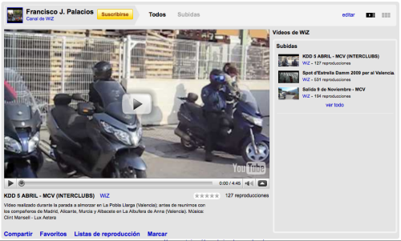

Aunque aún es un proyecto en fase beta me parece interesante comentarlo porque, a mí por lo menos, me ha gustado mucho. Algo que, a mi parecer, fallaba en YouTube eran los canales; aparte de que llevan media vida estando con el mismo diseño, eran horribles. Y los diseños predeterminados, más horribles todavía. Y el gusto de algunos en hacerse sus perfiles con colores chillones, más todavía, aunque eso ya entra en gusto de cada cual. 

El caso es que se han decidido a dar progresivamente el paso y podemos ver una previsualización de cómo quedará, por ejemplo arriba tenemos mi canal, donde se puede ver una mejor organización, con todo mucho más espaciado y bonito. Ya era hora.

Si tú también quieres poder ver los nuevos canales puedes conseguirlo [desde este enlace](http://www.youtube.com/super_seekrit); una vez hayas cambiado podrás volver al antiguo diseño, pero creo que no tiene mucho fundamento pues este es mil veces mejor. Y más bonito.

Bien por YouTube.
