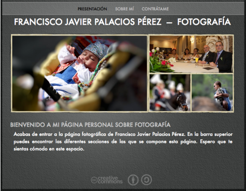

Aunque quizá más que una [página personal dedicada a la fotografía](http://fotografia.fjp.es) podría considerarse un _microsite_ personal a modo de _portfolio_, o carta de presentación, enfocado a la fotografía. Hasta ahora tenía una sección dentro de mi [página personal](http://fjp.es), pero he creído conveniente independizarla un poco, haciendo ir desde la propia página personal a quienes estén interesados a la nueva web. Aparte, también podéis ver nueve de las fotos que he realizado. A lo mejor pongo otra sección más y meto un popurrí de fotos, ya veremos.

Lo que más me ha gustado es que es la primera web que creo utilizando únicamente la aplicación [iWeb](http://www.apple.com/es/ilife/iweb/) de **Apple**. Mis páginas siempre las he programado a base de editor de textos (depende de la ocasión: [Smultron](http://tuppis.com/smultron/), [TextMate](http://macromates.com/) o [TextWrangler](http://www.barebones.com/products/TextWrangler/)) pero esta vez quería algo sencillo y rápido de hacer. Y vaya si ha sido rápido, y sencillo.

Hasta ahora iWeb lo había descartado por lo poco personalizable que es, precisamente por estar enfocado a gente que ni quiere ni tiene por qué saber nada de HTML. Y aunque no lo había probado, me lo imaginaba tal como es, pero si acaso un poco más flojo. Y es que en nada de tiempo he tenido una página bastante atractiva con un diseño elegante y subida automáticamente al servidor FTP que yo mismo le he facilitado. Más fácil imposible.

Me quedaré con la parte buena, y es que a ver si con esto alguien se anima y me saco algún dinerito extra, jeje.

¿Qué os parece la página?
