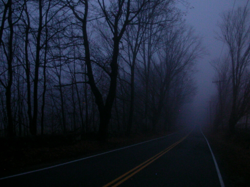

Quienes me conocéis o me seguís sabéis que los fenómenos paranormales son algo que me fascina. Ante cualquier cosa imprevista por mi cabeza suelen pasearse pensamientos de esta índole: un ruido, una luz, algún movimiento… Siempre trato de buscar alguna explicación más allá de donde llegaría la lógica. Aunque normalmente siempre me lo callo porque son cosas que no a todos gustan. Pero a mí me divierte, me entretiene, me hace pensar y darle vueltas a la cabeza con las teorías; a veces me puede la sugestión y en los que serían peores momentos es cuando mejor lo paso.

El viernes volvía de una boda. Volvía con mi moto y tenía dos opciones, o volverme por la autovía o disfrutar de la noche y su fresquito paseándome por una carretera secundaria que está muy bien. Cruzas algunos pueblos donde a esas horas nadie más te acompaña. Y dejados atrás, únicamente te encuentras con la compañía de la siempre presente luna blanca, iluminando levemente las copas de los árboles que aderezan los arcenes de las vías por donde marchas.

Como no podría ser de otra forma, mientras disfrutaba de pasear a lomos de mi moto en la oscuridad de la noche pensaba en la multitud de leyendas urbanas que tienen como denominador común una carretera. Incluso recuerdo al menos tres relatos de [Teo Rodríguez](http://teorodriguez.com) que también se centran en este escenario que, con determinadas palabras bien dichas, pondrían los pelos como escarpias a cualquiera. En esos momentos me hubiera gustado poder estar escuchando al mismo tiempo **Milenio 3**, tal como hiciera en aquellas vacaciones donde escuchara un relato sobre la **Santa Compaña** desde la mismísima Galicia. Increíble.

Fue un viaje placentero. Después de un día caluroso acechó la noche dejando el típico fresquito de esta zona (que dicho sea de paso, no todas las noches de este año se deja caer), y mi mente haciendo de las suyas. Como casi siempre.

Y por qué cuento esto, pensaréis. Pues no lo sé. Y no lo sé porque quizá ni esté contándolo tal como en su momento lo vivía. O quizá sí, pero no sea capaz de hacéroslo llegar así a vosotros.

A lo mejor, si me lo pienso, quizá un día de estos os contaré algo de la casa donde vivo, que seguro que os gustará.
