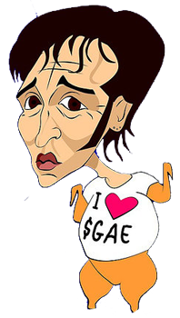

Llevo tiempo queriendo publicar esto pero no había podido hasta ahora, así que a estas alturas ya no os diré nada nuevo cuando comento que Ramoncín es, este año, **uno de los que ejercen de jurado** del archiconocido programa de creación de nuevos talentos [Operación Triunfo](http://www.operaciontriunfo.com/).

Pero bueno, el caso no es ese. Poco importaría eso si no fuera porque **hace unos años él mismo era quien se sumaba a criticar el programa de una forma atroz**. Y claro, menos importaría aún si no fuera el primero en erigirse **representante y defensor acérrimo de esa empresa que poco a poco va demostrándole a los españoles de qué son capaces y la poca vergüenza que tienen**. Claramente me refiero a la **SGAE**.

> ### Otro timo no
> 
> Corren malos tiempos para la música. Como cualquier otra manifestación actual de cultura popular, la música se sostiene sobre dos columnas: el arte y el negocio. Ambos se necesitan. Sin el negocio, la música no llegaría hasta la gente. Sin música, sin compositores, sin intérpretes, sin talento, sin arte al fin y al cabo, el negocio no tendría nada que vender. Hoy, sin embargo, esta ley está siendo profundamente alterada. En el panorama actual, el negocio lo ocupa casi todo, mientras que la música tiende a ser sustituida por un sucedáneo que da el pego. La última maniobra en este sentido lleva por título ‘Operación triunfo’.
> 
> [seguir leyendo…](http://www.formulatv.com/1,20090510,11310,1.html)

Esas eran las primeras líneas de una infame carta en la que, **además de Ramoncín**, muchos otros artistas de este país apoyaron, como pueden ser: **Loquillo, Joaquín Sabina, Ismael Serrano, El Canto del Loco, Jaime Urrutia, Miguel Ríos**, etc.

En el caso de los demás, pensemos que lleven razón o no al apoyar esa causa, no han cambiado de opinión hasta el momento y siguen reafirmándose de lo dicho hace unos años atrás; en cambio Ramoncín -o más conocido como el Rey del pollo frito- **ha pasado de ser el detractor número uno de este programa a participar en él activamente dándoles ánimos a los concursantes y haciendo ver que si siguen haciendo lo que están haciendo llegarán lejos**.

Y no es que toda la culpa sea suya, porque todavía hoy **no comprendo cómo Telecinco ha permitido que esa persona se siente a dar veredicto a alguien**, cuando su juicio musical carece de sentido alguno, por no meterse ya en calidad. **Alguien que ha fracasado en todo lo que se ha propuesto** ni merece ni tiene el por qué de dar consejos a los demás, que aunque con una carrera menos conocida que la de él, creo que en su vida alcanzarán a tener tantos detractores por méritos propios.

No seré yo quien defienda este tipo de programas porque para uno que pueda salir medianamente decente (véase el caso de **Chipper** de la pasada edición) salen un montón de artistas del montón que se empeñan en querer ser algo en el panorama musical de este país y lo máximo que consiguen, en el mejor de los casos, es la grabación de un disco que nadie más aparte de _un montón de prepúberes quinceañeras_ comprarán. Aunque lo más sensato siempre sería mantener la misma postura que adoptas desde el primer momento. El ir cambiando de opinión y de pensar según el interés tiene un nombre, y precisamente no deja en buen lugar a la persona a la que se califica de ese modo. Un prodigio como Ramoncín esas cosas debería saberlas.

Semanas atrás, la noticia de que **la SGAE pretende cobrar un dineral a la familia que organizó un concierto benéfico** para obtener dinero para la cura de una enfermedad que tiene su hija; más tarde, en Valencia, llega la noticia de que **quieren cobrar cerca de quinientos euros a un colegio por haber hecho una actuación en el [Palau de la Música](http://www.palaudevalencia.com/) en Navidad cantando villancicos**; ahora consienten que una de sus máximas cabezas visibles vaya en contra de lo que ellos mismos adoctrinan. ¿Queremos más?, ¿qué más necesitamos para saber qué clase de gente son?

Como final jocoso sólo me queda añadir un… **¡viva Risto Mejide!** xD
