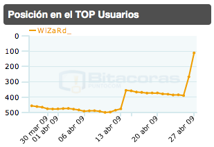

No hay que ser demasiado avispado para que, tras ver el theme de este blog, no se sepa que **me encantan las redes sociales**. Pero voy más allá. Lo que quiero hacer es una valoración un poco global de las redes que utilizo, para qué, por qué, y a cuáles les dedico más tiempo. Es algo que realmente me engancha, y aunque vaya por rachas el cambio de una a otra, **siempre mantengo un vínculo a cada una de ellas**. Al menos una vez al día suelo visitarlas para ver, sobre todo, qué han hecho mis amigos. Si alguien ha puesto alguna fotografía nueva, etc. Es como un Gran Hermano pero con las personas que conoces. Y eso me encanta. xD

Paso a listar **por orden de uso y, por ende, de preferencia**. Ya que obviamente la que más uso es la que, por un motivo u otro más me gusta. Os dejaré también un enlace en cada una de ellas a mi cuenta porque, aunque lo tingo en la barra lateral, quizá ni os hayáis percatado, jeje.

#### 1Facebook ([mi cuenta](http://www.facebook.com/profile.php?id=826302220&ref=profile))

**Sin duda es la que más uso, con diferencia.** Por todo: me encanta la cantidad de usuarios que tiene, la cantidad de cosas que diariamente sacan nuevas para hacer (aunque odio las guerras de pandillas y derivados), la estructura que tiene incluso, como se puede apreciar, su diseño. Es diáfano, espaciado, poco colorido, y encima el color que lleva es en azul: color poco molesto y atractivo. Como contrapartida detecto que **en España aunque va aumentando no ha terminado de cuajar aún**; y menos entre la gente joven. Desde luego, si **Facebook** un día comprara **Tuenti** sería increíble.

#### 2Bitacoras.com ([mi cuenta](http://bitacoras.com/usuario/Javi/))

Hace muy poco tiempo que vengo usando **Bitacoras.com** como red social en sí. Desde que tengo blog he usado **Bitacoras.com** meramente para sus directorios, para hacer ping de los artículos automáticamente cuando los subo y demás; en definitiva **para darme a conocer**. Actualmente sigo haciendo lo mismo, pero además estoy aprovechando su más o menos reciente función social para conocer nuevos blogs, dar puntos a los artículos que creo que son merecedores de ellos y, en definitiva, enterarme de muchas más cosas que visitando blog por blog _a mano_ y teniendo que seguir feeds de muchos más blogs de los que realmente considero _mis principales_. Una muestra de la evolución que en pocos días he tenido se puede apreciar en mi gráfico del [top de usuarios](http://bitacoras.com/top/usuarios) de **Bitacoras.com**. Desde que la empecé a usar **estoy dándole mucha caña y exprimiéndola al máximo**.

#### 3Last.fm ([mi cuenta](http://www.lastfm.es/user/fjpalacios))

**Last.fm** es sin duda la que más uso, pero **no como red social en sí**. Me explico. Con todas las aplicaciones que tienen soporte siempre envío lo que esté escuchando. Incluso envío lo que escucho en el iPod. Con esto consigo que los que sí usan **Last.fm** como red social sepan mis gustos y lo que escucho. **Lo que no hago es ir mirando perfiles para saber qué es lo que escuchan los demás**. El primer motivo puede ser que no me llama ni me entretiene; el segundo es que tampoco me importa demasiado.  No quería dejarla más abajo porque realmente la utilizo muchísimo, pero no como red social. Así que de esta poco tengo que decir. Ni para bien ni para mal.

#### 4Tuenti ([mi cuenta](http://www.tuenti.com/?m=profile&uid=62081222))

**Tuenti** es otra red que mínimo una vez al día visito. Y no es porque me guste, porque para nada. Más bien es porque **tengo en ella a mis amigos de la infancia (que no están en Facebook)** y por contrapartida a ellos sí les gusta. Además, he podido encontrar mucha gente de cuando iba al colegio, incluso las típicas fotografías que te hacen en primaria con toda la clase junta. Vamos, que es una red que utilizo para ver qué hacen y qué ponen los amigos del colegio. Sinceramente no sé qué le han visto a **Tuenti**, porque con **Tuenti** no puedes hacer **NADA**. Encima el diseño no es que sea gran cosa. Y las opciones para personalizar tu perfil distan muchos de las de, por ejemplo, **Facebook**. **¿Tuenti ha nacido para ser comprada por Facebook?** Yo diría que sí.

#### 5Youtube ([mi cuenta](http://www.youtube.com/user/WiZ))

**Es otra red social que tampoco uso como tal**. O al menos no tanto como las demás. Si es cierto que tengo contactos y gente a la que sigo, pero son las menos. Normalmente busco vídeos, sean de quien sean, los veo y listo. Ni agrego a nadie, ni pongo en seguimiento a nadie ni nada similar. Si me agregan a mí y lo que tienen ellos me gusta pues acepto, pero poca cosa más. Para esto sí la utilizo muchísimo. Tiene un dseño también bastante cuidado y en fin, todos conocemos **YouTube**, ¿no?

#### 6Flickr ([mi cuenta](http://www.flickr.com/photos/wizard_/))

Es una red social de la que incluso he llegado por dos años a ser miembro **PRO** (vamos, de los que pagan para tener más ventajas). Hace tiempo que de forma tan regular medio colgué la cámara, así que **ahora mismo apenas la utilizo** ni siquiera mantengo ya los privilegios de la cuenta **PRO** por no haber seguido renovándolos. Mi cuenta sigue ahí y todo sigue ahí en espera de que tenga tiempo/ganas de volver a salir a la calle cámara en mano y necesite un lugar donde colgar mis fotografías.

Y poco más. Son todas las redes sociales que utilizo aunque como se ha podido observar en todas no exprimo tanto su función social como en otras. Algo que me gustaría destacar de casi todas ellas es **la carencia en atención al usuario**. En casi todas he enviado correos por una cosa u otra, y rara vez me han contestado diciéndome algo. En Facebook por ejemplo tienen una zona especial tipo foro donde poder hacer tus preguntas… pues vamos, los que a veces contestamos somos los usuarios, porque **ellos desde hace un tiempo atrás no contestan a NADA**.

Y ya que estamos sociales… ya sabes, aquí debajo tienes un botoncito para que, si te ha gustado el artículo, **me lo votes en Bitacoras.com** xD
