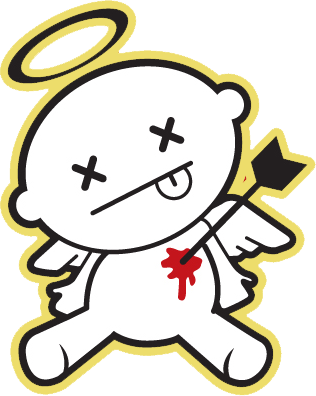

Qué queréis que os diga, este no es un día señalado para mí. O quizá sí lo sea, aunque no como me hubiera gustado que fuera desde ya hace algunos años atrás. Se supone que este es un día feliz, alegre, divertido, para salir de la rutina **en pareja**… aunque la práctica es bien distinta. Al menos, obviamente, para mí.

Ha dado siempre la casualidad que aunque haya tenido pareja antes de llegar este día siempre lo hemos dejado. Hablaría de “_la maldición del 14F_” como podría decir [Iker Jiménez](http://www.ikerjimenez.com), pero no estaría siendo consecuente conmigo mismo. Simplemente eso, casualidades… espero.

Sé seguro que aunque hoy tuviera pareja no querría hacer lo que ya consideramos como _típico_, o en otras palabras lo que manda hacer El Corte Inglés. Pienso que días para regalar algo hay muchos, no tiene por qué ser necesariamente hoy. Además, cuando se regala por “obligación” el regalo no es lo productivo que pueda ser cuando se regala por una “necesidad”.

El día de hoy no lo veo así, para nada materialista, si no que lo veo más bien como un día, aparte del aniversario, de recordar qué se es, qué está pasando y a dónde se quiere llegar. Es un día , por ejemplo, para pasar relajados en un sofá, tapados con una manta por el frío que está haciendo… Para que aunque no haya que hacer ni decir nada, con estar juntos sea más que suficiente. Para desconectar del día a día. Para recordarse mútuamente que aún sientes algo por una persona, aunque a veces se olvide con el paso del tiempo. No un día materialista, eso no me gustaría.

Sea como fuere la cruda realidad es que estoy solo. Y hoy más que nunca puedo decirlo bien claro. No es, para nada, que ahora mismo esté pasándolo mal… pero si tienes ese _ay_ o ese _qué hubiera sido si…_ o el _qué hubiera pasado…_ Lo que solemos conocer como añoranza o nostalgia.

No me queda otra que consolarme y presumir diciendo que no seré yo quien se ponga unos calzoncillos con corazones o quien vaya a gastarse cincuenta euros en un ramo de rosas (aunque por otra parte esto no me importaría demasiado hacerlo).

The show must go on…
