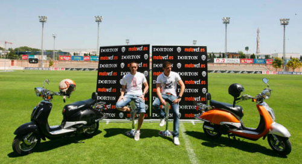

Si hace un tiempo recibíamos noticias de la unión del [Valencia CF](http://www.valenciacf.com) con [Honda](http://www.honda-montesa.es/) creando el **Valencia CF-Honda SAG Team**, cuya cabeza visible destaca la figura del gran [Héctor Faubel](http://www.fau55.com), hoy hemos tenido la presentación de **la moto oficial del Valencia CF**. Se trata de una **scooter de 125c.c** clásica de similares características a aquella **Aprilia Habana** que tan de moda se pusiera en la _Ciudad del Turia_ tiempo atrás.

La marca encargada de hacer realidad la moto de los valencianistas ha sido [Dorton](http://www.dorton.es). Y por propias palabras de quienes han hecho la presentación hoy **se podrá adquirir a partir de junio** en cualquier tienda del Valencia CF y en muchos de los concesionarios de motocicletas repartidos por la ciudad de Valencia.

No tenemos muchas más noticias, a ver qué nos depara. Sinceramente, no me la compraría, pero todo lo que sirva para promocionar el Valencia CF bienvenido sea.

**¡AMUNT!**
