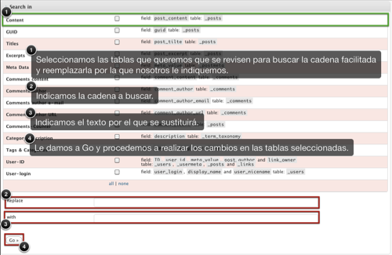

 Cuando me ocurrió [aquél problema con las codificaciones](http://fjp.es/wordpress-2-9/) hace poco, tras un comentario de [zanguanga](http://www.zanguanga.com/), descubrí el plugin [Search and Replace](http://wordpress.org/extend/plugins/search-and-replace/). Y la verdad es que es muy útil. Voy a explicaros, un poco por encima (aunque es muy fácil) cómo funciona y, además, aportaré unas modificaciones que le realicé para que su rendimiento sea aún más óptimo.

### Funcionamiento

Como bien indica el nombre del plugin, lo que hace es buscar una cadena de texto que nosotros le especifiquemos y, asimismo, reemplazarla por la que nosotros le indiquemos. En mi caso, me hubiera sido muy útil para reparar los errores de codificación, ya que proporcionándole el carácter erróneo que hemos obtenido, sabiendo por cuál debe ser reemplazado correctamente, e indicándoselo, tendríamos la papeleta resuelta en un santiamén.

La imagen que os proporciono arriba es lo que veríamos tras, una vez instalado el plugin, irnos al panel de administración y a su sección de configuración. Como veis, es muy sencillo. Simplemente basta con seleccionar las tablas en las que queremos que se consulten las búsquedas (generalmente, todas), indicarle la cadena de texto a buscar y la cadena de texto por la que será reemplazada.

### Modificación

Es cierto que el plugin es bastante completo, pero en mi caso que tenía toda la codificación patas arriba me fue útil añadirle dos _zonas_ más donde hacer las consultas y las posteriores modificaciones, si las requiere. Y es que, en los perfiles de nuestros usuarios registrados, es probable que tengamos alguno con algún carácter extraño, alguna letra acentuada, o incluso la letra ñ. Y, en estos casos, el plugin tal como viene _de serie_ no haría nada porque en esas celdas _no se fija_. ¿La solución? conseguir que _se fije_ para que podamos cambiarlo también.

Lo primero que debemos hacer es ir a nuestra carpeta de plugins, generalmente en **/public\_html/TUBLOG/wp-content/plugins**; de ahí nos vamos a la carpeta del plugin: **search-and-replace** y abrimos el archivo **search-and-replace.php**.

1. Buscamos esta parte del código:
    
    $query  = "UPDATE $wpdb->usermeta ";
    $query .= "SET user\_id = ";
    $query .= "REPLACE(user\_id, \\"$search\_slug\\", \\"$replace\_slug\\") ";
    $wpdb->get\_results($query);
    
    Y justo debajo añadimos esto:
    
    $query  = "UPDATE $wpdb->usermeta ";
    $query .= "SET meta\_value = ";
    $query .= "REPLACE(meta\_value, \\"$search\_text\\", \\"$replace\_text\\") ";
    $wpdb->get\_results($query);
    
2. Ahora, poco más abajo, buscamos esta otra parte de código:
    
    $myecho .= searchandreplace\_results('user\_nicename', 'users', $search\_slug);
    
    Y justo debajo, también, añadimos esto otro:
    
    $myecho .= searchandreplace\_results('display\_name', 'users', $search\_slug);
    
3. Más abajo tendremos esta otra parte de código:
    
    $query .= "SET user\_nicename = ";
    $query .= "REPLACE(user\_nicename, \\"$search\_slug\\", \\"$replace\_slug\\") ";
    
    Y, como antes, justo debajo añadimos esto:
    
    $query .= "SET display\_name = ";
    $query .= "REPLACE(display\_name, \\"$search\_slug\\", \\"$replace\_slug\\") ";
    
4. Buscamos esta línea más abajo:
    
     `ID`, `user_id`, `post_author`  `link_owner`  
    `_users`, `_usermeta`, `_posts`  `_links`
    
    Y la **reemplazamos** por esta otra:
    
     `ID`, `user_id`, `meta_value`, `post_author`  `link_owner`  
    `_users`, `_usermeta`, `_posts`  `_links`
    
5. Y, por último, buscamos esta línea:
    
     `user_login`  `user_nicename` table: `_users`
    
    Y la **reemplazamos** por esta otra:
    
     `user_login`, `display_name`  `user_nicename` table: `_users`
    

Guardamos cambios y ya lo tenemos. Ahora, cuando busque en la base de datos SQL buscará también en los nombres de nuestros usuarios registrados y, si procede, reemplazará la cadena indicada por lo que nosotros queramos.

Espero que os resulte útil.

\[ayuda\]
