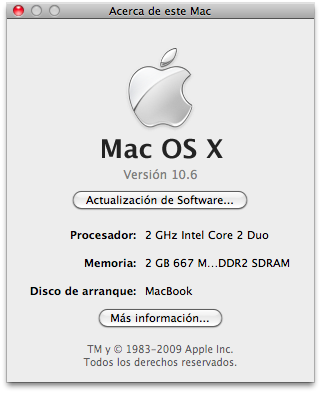

Hoy por fin instalé **Snow Leopard**. Y con éste van tres los sistemas operativos de Apple que pruebo. Mi migración de Tiger a Leopard fue como actualización, así no perdía nada de lo que tenía en mi disco duro. Pero **en este caso me hice servir de las copias de seguridad que voy generando con Time Machine para así poder hacer una instalación desde cero**, prescindiendo así de los archivos que van quedándose y ya no son útiles y recuperando todo lo que almacené en la última copia de seguridad.

Y es que si algo se puede destacar de Time Machine, es que no solamente te sirve para recuperar algún fichero que, por error, hayas eliminado. Si no que también **hace una copia de todo el sistema** para que, en caso de incidente, puedas recuperarlo todo tal cual lo tenías. **Y cuando digo todo es TODO**.

La instalación la realicé desde un disco duro externo USB. Hice una partición para Snow Leopard, le metí la imagen del disco y después de reiniciar ya estaba en marcha la instalación de Snow Leopard. Tras la elección del idioma, borrado de disco, elección de elementos a instalar (opcional) y una media hora larga de tiempo libre OSX 10.6 estaba instalado. Solamente sería suficiente otro reinicio más para que me preguntara si quería empezar a configurarlo de cero, transferir datos desde otro Mac o **realizar una copia desde Time Machine**. Como dije al principio, esta última sería mi opción. Dos horas largas más de espera (esto varía dependiendo de lo que ocupe tu copia de seguridad en Time Machine) y ya tendría mi ordenador tal cual lo tenía antes de haber empezado el proceso.

El resultado, pues _de cara al usuario_ no tiene grandes novedades, pero internamente sí se puede apreciar **mayor velocidad en la ejecución de aplicaciones y a la hora de apagarlo o reiniciarlo**. En el mío al menos, en el proceso de encendido no noté gran novedad, pero dicen que sí va más rápido.

En fin, nuevo sistema operativo de Apple que, se supone, será el que compita con Windows 7. Un servidor sigue quedándose en _el lado blanco_.
