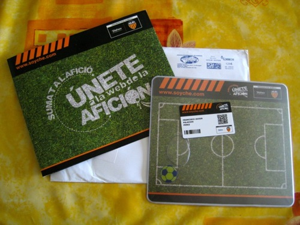
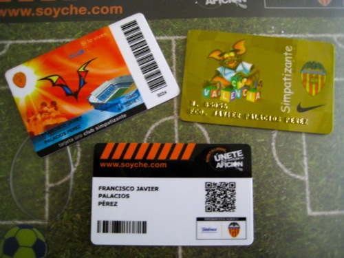

Hace unas semanas me registré en la página [soyche.com](http://www.soyche.com); sí es cierto que me pidieron mis datos pero no creo recordar que pusiera nada de que me iban a regalar nada. En fin, casi mejor porque así me ha hecho más ilusión.

Cuando volví de trabajar en el buzón estaba esperándome un sobre grande de esta página web, me quedé sorprendido porque no esperaba nada, pero al abrirlo vi el detalle y me encantó. Se trata de una alfombrilla para el ratón que tiene agua en su interior y un balón para que cuando pases el ratón vaya moviéndose.

Pese a no ser socio del club como se puede ver ya son tres carnés del [Valencia CF](http://www.valenciacf.com) los que tengo. Que realmente no sirven ya de mucho, pero en fin. En la imagen se puede ver la **tarjeta simpatizante ORO** de la temporada pasada (este año no la renové, gracias por ayudarme crisis), la **tarjeta simpatizante BRONCE** (es gratis, no se renueva) y la de ahora, de **soyche.com**.

**¡AMUNT!**
