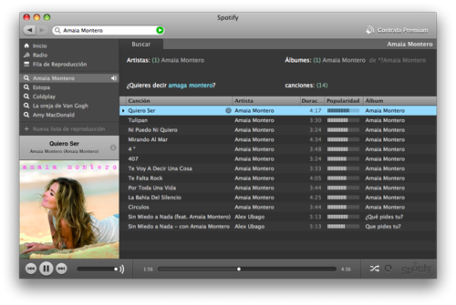

Mucho se ha hablado ya de esta aplicación para Windows y Mac, pero no fue hasta anoche cuando probé [Spotify](http://www.spotify.com/) gracias a una recomendación de una amiga. Había probado un servicio similar como es [Rockola.fm](http://www.rockola.fm/) pero no me gustó **para nada**. La lentitud a la hora de escuchar música y la limitación de no pasar demasiado rápido de una canción a otra me echaron atrás. Sinceramente, pensaba que Spotify iba a ser _la misma “mierda”_. Pero ni mucho menos, estaba totalmente equivocado. Nos ofrece una buena integración con Mac, dotándola de ese _estilo Mac_ que tanto nos gusta a los maqueros.

**Tiene un cúmulo de ventajas increíbles**. Como también se ve en la imagen he ido haciendo **búsquedas de artistas o grupos** y las deja almacenadas para que no tengamos que escribir cada vez el nombre (se pueden borrar si quieres); tienes **listas personalizables** para poder tener artistas variados dentro de una lista, o también **listas automáticas** donde te selecciona la aplicación artistas que tienen relación entre sí y puede que te gusten.

Desde la sección de inicio tienes las **últimas novedades enfocadas a la música que has ido escuchando**, para que encuentres nuevos artistas. Y lo mejor de todo es que **la velocidad a la que se descarga las canciones es de vértigo**; no sé cómo lo hará, pero lo hace. Nada más comenzar una canción puedes, si quieres, escuchar directamente el final. Sin problemas.

Quizá **el punto débil de Spotify es la radio**, que aunque tienen miles y miles de canciones, se les va de madre. Creo que tienen un lío gordo de metatags con géneros y años porque anoche estaba escuchando Hip-Hop de actualidad y entre medias me saltó Elvis Presley. xD Esto no se aprecia en las búsquedas normalmente porque si buscas por grupo/artista o por canciones esos datos sí son correctos. Pero bueno, quitando eso puedes llegar a toparte con alguna canción que te gustara y no sabías cómo se llamaba como me pasó a mí. Otra carencia de la radio es que apenas sale música en español (aunque en Spotify si realizas búsquedas hay a mansalva). Claro, si se llamara Gramola en lugar de Spotify sí tendríamos música en español… pero por contra tendríamos que _soportar_ a Alejandro Sanz, el papito, el chikilicuatre y demás. xD

Spotify dispone de dos versiones, la básica que es gratuita y además una premium, que lo que hace es evitarnos los anuncios visuales que el programa aleatoriamente va poniéndonos en pantalla y alguna cuña publicitaria que va sonando, pero suena tan espaciadamente que no creo que siquiera merezca la pena pagar por una versión premium. Sale solamente una cuña publicitaria cada rato. Muchísimo menos que las radio fórmulas clásicas de las radios de ondas hertzianas.

Algo que me sorprendió gratamente es **su parte social** pues tiene, desde el menú de preferencias, posibilidad de **vincular tu cuenta de [Last.fm](http://www.lastfm.es)** para poder ir poniendo allí las canciones que vas escuchando. Todo un acierto.

Lo que me faltaba a mí para estar siempre escuchando música… :$
