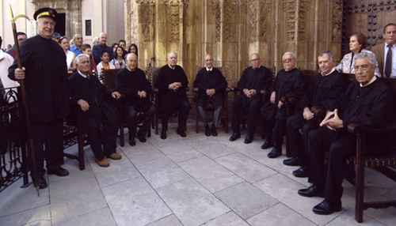

No puede decirse que esto sea una noticia de última hora, puesto que hace ya días que se sabe. De hecho, este jueves, tuvo lugar el primer tribunal siendo éste ya Patrimonio Cultural Inmaterial de la Humanidad. Es un galardón y un honor que sin duda merecía por ser una de las entidades judiciales más viejas del mundo, y la más vieja de Europa.

Para quien no lo sepa, el Tribunal de las Aguas (en valenciano, _Tribunal de les Aigües_) **es un jurado encargado de dirimir los conflictos generador por los agricultores de la Comunidad de Regantes de la Vega de Valencia**. Las acequias sobre las que tiene potestad esta entidad son las acequias de **Quart, Benagéber i Faitanar, Tormos, Mislata, Mestalla, Favara, Rascanya y Rovella**.

…testimonio único de una tradición cultural viva: la de la justicia y el gobierno democrático y autogestionario de las aguas por parte de los campesinos…

Los motivos por los cuales este tribunal suele pronunciarse más frecuentemente suelen ser hurto de agua en tiempos de escasez, rotura de canales o muros, _sorregar_ echando agua en campos vecinos que dañan la cosecha por exceso de ésta, alterar los turnos de riego tomando el agua el día que no procede, tener las acequias sucias que impidan que el agua circule con regularidad, levantar la _parada_ cuando un regante está usando su turno, regar sin solicitud de turno, etc. Para quienes no sepan de qué va todo esto, es sencillo, la persona denunciada es citada por el Guarda de la acequia para el jueves siguiente. Hasta dos veces más es citado y, si no acude tampoco a la tercera citación, tras admitirse la denuncia, se le juzga en rebeldía pudiendo ser condenado.

En el acto en sí, los síndicos de las respectivas acequias se sientan en los sillones designados para tal efecto, asiste también el Alguacil del Tribunal, portando como insignia un arpón de latón dorado. Éste solicita al Presidente la venia para iniciar las citaciones y comienza con la famosa frase _¡Denunciats de la Séquia de Quart!_ acudiendo los denunciados, si los hubiere, acompañados por el Guarda de la Acequia. Las citaciones se van haciendo por el orden en que las acequias toman el agua del río (orden anteriormente citado). El Guarda expone el caso o presenta al querellante, si hay acusador privado, y termina con la frase de ritual: _és quant tenia que dir_. El Presidente inquiere: _¿qué té que dir l’acusat?_, y pasa a defenderse el acusado. El desarrollo del juicio totalmente en **llengua valenciana**. Todos intervienen en su propio nombre, ni abogados, ni documentos escritos; pueden proponer testigos e incluso inspección ocular (la _visura_). El Presidente y miembros del tribunal pueden hacerle las preguntas necesarias para mejor información del caso y, sin más trámite y en presencia de los interesados, el tribunal delibera y sentencia. Para garantizar la imparcialidad, en la deliberación no interviene el Síndico de la acequia a la que pertenecen los litigantes; y también es norma que si el denunciado pertenece a una acequia de la derecha del río, la sentencia la propongan los síndicos de las acequias de la izquierda, o viceversa. Si la sentencia es condenatoria, el Presidente lo hace con la frase de ritual: _Este Tribunal li condena a pena i costes, danys i perjuïns, en arreglo a Ordenances_. Las Ordenanzas de las respectivas acequias establecen las penas para las distintas infracciones. Y no caben recursos ni apelaciones ya que la sentencia es ejecutiva de por sí; de ello se encarga el Síndico de la acequia. De esta forma tan simple y sencilla, al tiempo que tan efectiva y respetada por todos los miembros de una comunidad agrícola, ha solucionado sus problemas de aguas el laborioso pueblo valenciano desde los tiempos más remotos. No hay abogados, no hay documentos, no hay largísimos trámites burocráticos que retrasen lo que constituye el más elemental de los derechos humanos: la justicia.

Es un acto público al cual pueden y deben asistir todos los que vengan a visitar Valencia y estén aquí cualquier jueves del año. Y ahora, con más honor que nunca, ya que han sido agraciados con un importantísimo galardón. **Gràcies a tots els que, d’una forma o atra, fan lo possible per a mantindre l’història, cultura i tradicions valencianes en el lloc a on toca.**

- Página oficial del [Tribunal de les Aigües de la Vega de Valéncia](ttp://www.tribunaldelasaguas.com).
