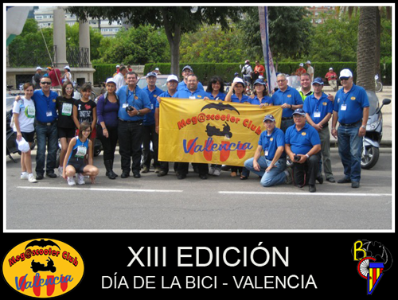
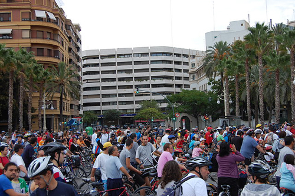

Como todos los años, en Valencia, el [Bici-club Valencia](http://www.biciclubvalencia.org) organiza a finales de verano el **Día de la Bicicleta de Valencia**. Ayer domingo tuvo lugar la edición número XIII de este evento patrocinado por el Ayuntamiento de Valencia y El Corte Inglés. Y como viene siendo costumbre, el [Megascooter club Valencia](http://www.mcvalencia.es) (motoclub al cual quienes me sigan habitualmente saben que pertenezco) junto con la Policía Local de Valencia se encarga de guiar a la _manada_ por delante, cerrar el paso por detrás y, obviamente, hacer los cortes de calles y cruces oportunos para que ningún vehículo pueda obstruir el paso de las 15000 bicicletas que se dieron cita este año según fuentes oficiales.

Personalmente me parece una iniciativa estupenda la que se tiene. Y es que aunque muchos no sigamos el ejemplo, es digno de admirar quienes día tras día cogen la bicicleta para ir a comprar, a trabajar, y en definitiva, sustituyen un vehículo a motor por el sano y ecológico pedaleo sobre dos ruedas.

Esperemos que año tras año siga celebrándose este día, y cómo no, que el **Megascooter club Valencia** siga ofreciendo apoyo logístico al evento.
