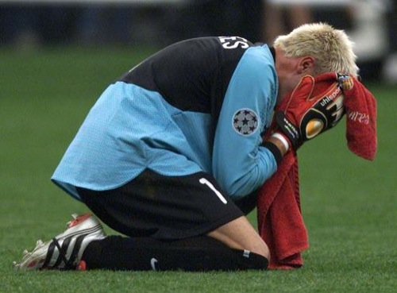

Nada más y nada menos que nueve años ha costado que al Bayern le dieran su merecido. **Gracias a ellos, la que encabeza el artículo será la imagen que los valencianistas guardemos de esa noche**. Y [como dije ayer mismo](http://fjp.es/fc-internazionale-campeon-de-la-champions-league-2010/), desde que me enteré qué dos equipos iban a disputar la final de la Champions League 2010 **de lo único que tenía ganas era de que ganara el Inter**. Fuese como fuese. Lo único que me importaba es que tanto los jugadores (que por desgracia no queda ya ninguno de aquella época) como la afición supieran qué se siente al llegar a las puertas de la Champions y quedarte en el camino. Aunque **hubiera disfrutado más si en lugar de haberse comido los goles Hans-Jörg Butt hubiera sido Oliver Kahn quien se los comiera**. Ese hombre me caerá mal toda la vida.

Son ya unos cuantos, nueve años... Nueve años de aquél penalty fatídico que nos privó de la felicidad completa; nueve años desde que ese portero al que nombré ya antes y no nombraré más veces celebrara su victoria puño en alto restregándonos por la cara que había sido mejor que nosotros; nueve años de aquél gol de Gaizka Mendieta, que inauguraba el marcador y nos hacía vibrar a todos pensando lo que cada vez estaba más cerca, pero que poco después Stefan Effenberg hacía que no sirviera de nada; nueve años nada menos... nueve años de aquellos penaltys de Zahovic, Carboni y Pellegrino que pudieron haber entrado pero la (mala) suerte de los penaltys hizo que no entraran...; nueve años hace que vimos a quizá los jugadores más comprometidos con su equipo que hemos visto en muchos años, que tal como la afición, hundidos no podían dejar de llorar pensando lo que ahí estaba pero que se nos escapó...

Y son, como dije, **nueve los años que han hecho falta para que el Bayern de Múnich supiera qué se siente al quedarse a las puertas de la final**. La alegría hubiera sido completa si el equipo que les hubiera dejado a las puertas de la gloria hubiese sido el Valencia CF, pero todo no se puede conseguir. Ahora, ojalá el año que viene nos toque enfrentarnos en cuartos... entonces sólo desearé ganarles para que vean que aún se puede quedar peor de como quedamos nosotros entonces.

Pese a todo, y siempre: **¡AMUNT VALENCIA!**
