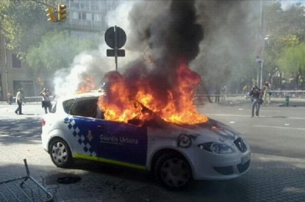
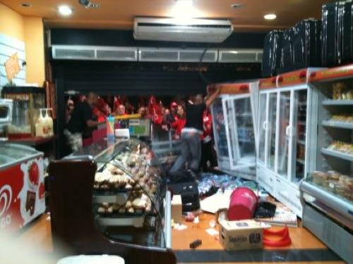
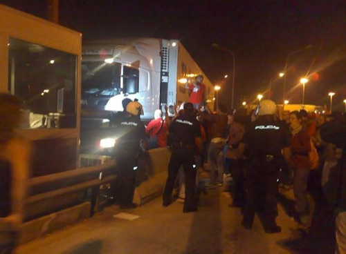
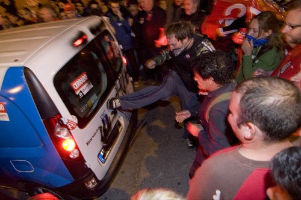
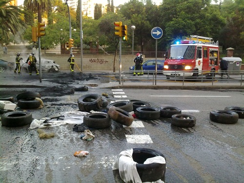

Una vez culminado el día, toca análisis. Y toca analizar, a mi juicio, lo tremendamente estúpidos e hipócritas que el ser humano puede llegar a ser. Hoy, estos mismos que falsamente defendían el derecho de los trabajadores españoles, han sido lo mismo que le han arruinado la vida (habiendo arruinado el negocio) a tantos y tantos españoles que estaban en su derecho, y lo ejercían, de no secundar hoy la huelga. Estos mismos valientes son quienes amparándose y llenándoseles la boca de gritar **DEMOCRACIA** extorsionan y amenazan cual vil delincuente digno de entrar en prisión a todos aquellos que no piensen como ellos.

Al ver los vídeos e imágenes que he visto hoy, realmente no sabía si estaban emitiendo imágenes de un país civilizado, como teóricamente lo es este en el que vivimos, o estaban emitiendo imágenes de un conflicto bélico en algún país tercermundista en que que, obviamente, en un impulso de hipocresía ningún sindicalista se vería reflejado. Y sí, una cosa son los piquetes informativos, y otra la manifestación que ha habido en todas las capitales de provincia. Pero si jugamos al juego de buscar las diferencias, veremos que en ambos escenarios las banderas que ondeaban eran las mismas. Y entonces, digo yo, ¿a quién pretenden engañar? ¿realmente pretenden que nos creamos que ambas cosas no van ligadas? ¡es cómico, cuanto menos!

¿Toda esta gentuza son quienes deben defender nuestros derechos? ¿Estos con pinta de no haber trabajado en su vida y no tener ni oficio ni beneficio? Estos **VÁNDALOS** que si no se excusaran en una falsa manifestación disfrazados de piquetes _informativos_ irían a la cárcel. ¿Qué diferencia hay entre esta gente y las bandas organizadas que asaltan recintos privados? La única que le encuentro es, de nuevo, la hipocresía. Las ganas de combatir las bandas, de cara a la galería, y después que ellos hagan lo mismo durante todo un día, amparándose en ese derecho a hacer huelga que deben imponer a todo el mundo a un grito unísono de **¡viva la democracia!**

Todos esos que defienden nuestros derechos, según ellos, son los mismos que con rotunda seguridad votaron a Zapatero en su primer mandato, los mismos que le apoyaron de nuevo en el segundo mandato, los mismos que siempre han ido cobrando bajo mano del Gobierno, porque era lo que les interesaba. Esos mismos son los que hoy critican la figura de Zapatero en un vano intento de lavar su imagen, cosa que ya nadie se cree. Y seguramente serán los mismos que seguirán juntando ambas manos para recoger todos los billetes que se tienen preparados para ellos. ¡Ah! y que no se me olvide: seguramente serán los mismos que, una vez España esté hasta el cuello, sigan eligiendo a Zapatero como su Presidente. ¿No queríais Zapatero, chicos? Pues comeos lo que habéis votado democráticamente.

Todas las vergonzosas e insultantes imágenes que acompañan este artículo han sido obtenidas de [ForoCoches](http://www.forocoches.com/foro/showthread.php?t=1873937); éstas, muchísimas otras más, y bastantes más vídeos podréis encontrarlo en el enlace directo al foro, si es que queréis enteraros bien de lo que ha sucedido en este día. Un día para el olvido, sin duda alguna. Una huelga de pena, por mucho que quieran hacer creer. Y no porque los que no hayamos acudido a protestar estemos a favor de Zapatero, ni mucho menos, si no porque hacer esto, ahora, es una auténtica pérdida de tiempo. Yo no lamo el culo a ningún sindicalista ni ayudo a lavar su imagen. ¿Y tú?

P.D: **Zapatero dimisión**.
