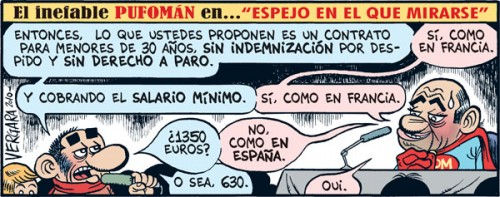

  
tira cómica de [Territorio Vergara](http://blogs.publico.es/vergara/1902/contrato-basura/)

No conocía [Territorio Vergara](http://blogs.publico.es/vergara/) hasta ver en el blog de [Arturo Aparicio](http://arturoaparicio.com/nuevos-contratos-basura/) un enlace hasta esta misma viñeta. Y es que simplemente es genial. Me he suscrito ya al feed porque realmente son buenísimas. Y ésta en concreto, no podía decir más con menos. Es la triste realidad a la que nos enfrentamos actualmente en este país. Sublime.
