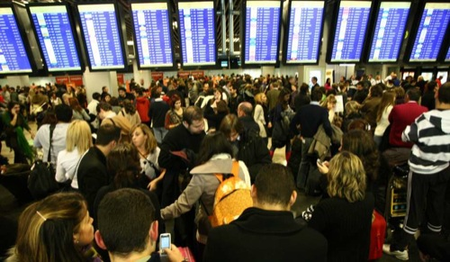

En mayor o menor medida, pasado el tiempo crítico por el que hemos pasado, habiendo abandonado el Estado de Alarma del que hacía mucho tiempo que no teníamos noticias, y con los controladores de nuevo en sus puestos de trabajo, quizá toque hacer una breve (o no tan breve, todavía no lo sé) reflexión. Por parte de ambos _bandos_.

### Controladores aéreos

**He sido el primero en cargar duramente contra los controladores en todo momento**, y quienes me seguís en Twitter lo sabréis. **Pero no por el fondo**, tema en el que hasta ahora no me metí, **si no por sus formas**. Sus formas, cuanto menos, exageradas, por decirlo de algún modo suave. Que quizá hasta de algún modo comprenda, porque **observando cómo sucedió todo, parece haber sido fruto de un calentón**; y yo, que soy persona de sangre caliente, puedo comprender que en determinados momentos se tengan reacciones que dejando que se enfríe la cosa no serían iguales; o al menos, estarían pensadas y realizadas de otra forma.

Desde el principio por la parte que corresponde al Gobierno se han dedicado a proclamar a los cuatro vientos que lo que los controladores solicitaban era más sueldo, pero como en todas las historias, existe la versión oficial y la versión real, y podemos ver como lo que realmente solicitan es ([vía](http://www.elmundo.es/elmundo/2010/12/04/espana/1291468865.html)):

- Contabilizar como horas extraordinarias hasta un tercio de su jornada de trabajo habitual, a fin de alcanzar unos salarios de entre 300000 y 1000000 de euros anuales.
- Jubilarse a partir de los 52 años percibiendo el salario íntegro, horas extraordinarias incluidas.
- Organizar su propio régimen de trabajo y su propio régimen salarial, de tal manera que sean ellos mismos, a través de su "sindicato", quienes determinen cuándo, cómo y cuánto se trabaja, y cuánto se cobra, independientemente de las necesidades del servicio.
- Garantizar el control por parte de su "sindicato" del acceso a la profesión y la formación de los nuevos profesionales.

Cosa que **podrá parecer peor o mejor, pero que derecho a solicitarlo sí tienen**. Y más aún sabiendo que si ocurre como en ocasiones anteriores, todas las peticiones que han ido solicitando se las han concedido. O al menos, en la teoría, porque es ahí donde viene el problema.

Y en fin, que a quién no nos gustaría que todo lo que exigimos se hiciera realidad. Y más, tratándose de las exigencias que se tratan. A mí también me gustaría ponerme mi propio sueldo y horario... Y si ellos además de quererlo, quieren ponerlo en práctica, pues olé por ellos. **Pero no jodiendo al resto de personas que debían desplazarse en avión, porque ellos no tienen la culpa.** Que además, todos los que estaban ahí sí son quienes realmente permiten que ellos tengan esos sueldos que tienen, no los que estábamos en casa viéndolo desde la televisión.

### Gobierno

**Si tú sabes que no vas a ceder ante determinada petición: sé claro. No digas que sí, para luego desdecirte y hacer como que aquí no ha pasado nada, porque no es así; las cosas no funcionan así**, y deberían saberlo. Y sabiendo con quiénes están tratando, que aunque se enfrenten a un delito de sedición, si quieren, te paralizan el país (como ha pasado), **lo que no se puede hacer es creerte más listo que ellos, dejar que pase el tiempo sin hacer nada, y esperar que al no darle importancia en los medios e ir pasando día tras día que van cumpliendo con su obligación, acabe olvidándose aquello que en su día se decidió aceptar, pero que no se ha aceptado ni (como se ve) se aceptará**.

Lo que no se puede es cambiar el Ministro de Fomento, Sr. José Blanco, cobrar un buen sueldo que pagamos todos los españoles (**el de los controladores únicamente lo pagan quienes viajan**, que por suerte o desgracia no es mi caso), y esperarse sentado en su silla de piel a ver por dónde viene el asunto. Porque luego pasa lo que ha pasado, y nos quedamos todos pensando a ver qué hemos podido hacer mal (o en su caso, qué hemos podido no hacer) y empezar a buscar culpables intentando lanzar la piedra sobre otro tejado, _a ver si cuela_. Y como verá, **no ha colado**. Pero hay que prepararse, porque quizá lo peor esté por venir. **Tal como lo han hecho una vez, podrán seguir haciéndolo tantas veces como les dé la gana**. Y seguro que no hay lo que hay que tener para dar la orden real de que sea el Ejército del Aire quien tome el mando de los aeropuertos y se pongan a dirigir el tráfico del espacio aéreo español... Todos sabemos si en ese estado hubiera un accidente, la que se podría liar. **Y estando tan bien como se está en esos sillones de piel, no interesa que por algo así os manden a todos de patitas para casa**. ;)

Sobre lo que se ha dicho, que el Partido Popular estaba detrás de toda esta baja médica masiva, pues como que ni me molesto en dar una opinión extensa de esto, **sería buscar lógica a unas palabras vertidas por personas ruínes y rastreras**, y sería perder el tiempo. Por cierto, ¿**Zapatero dónde estaba estos días**? Si no viaja, pero tampoco se le ve, de poco sirve.

### Conclusiones...

¿Que los controladores aéreos tienen derecho a ponerse en huelga como los demás? Por supuesto. ¿De la forma que lo han hecho? No. ¿Que deberían pagar por ello? Totalmente, aunque seguro que no lo harán, porque de forma oculta todo esto no es mas que una lucha de intereses, en la que como siempre, el perjudicado es el ciudadano.

¿Que el Gobierno debería haber preveído que esto iba a pasar? Claro, para eso les pagamos todos los ciudadanos. ¿Que han hecho algo por intentar impedirlo? No, nada. ¿Que van a hacer algo próximamente? Seguramente tampoco, la máxima de este Gobierno es no hacer para que no se note que se hacen mal las cosas, dudo que cambie ahora, después de estar así durante seis años.

Aunque no siva de nada, podemos seguir desahogándonos en Twitter mediante el hashtag #controladores y otros tantísimos que hay, o bien podemos leernos esta [carta de un controlador aéreo](http://www.rinconhamijo.com/2010/12/carta-de-un-controlado-aereo.html) donde hace ver que ellos son _los buenos de la película_ y que tantas cosas que sabemos (o creemos saber), en realidad son mentira. **¿Qué es verdad y qué es mentira? nunca lo sabremos; lo que sí sabremos es que este tres y cuatro de diciembre permanecerán en la historia de este país, y sobre todo, en la historia de este Gobierno**, los que seguro que no se esperaban que en la misma semana de anunciar que **a los parados nos anulan la irrisoria ayuda que nos daban** y que **privatizan la Lotería y los aeropuertos de Madrid y Barcelona**, los controladores iban a _liársela parda_. **Y pese a todo, seguro que no hay dimisiones**. ¡Qué bien se está cobrando por no hacer nada!

**Y no, al final no me salió breve. Ya me extrañaba a mí...**
