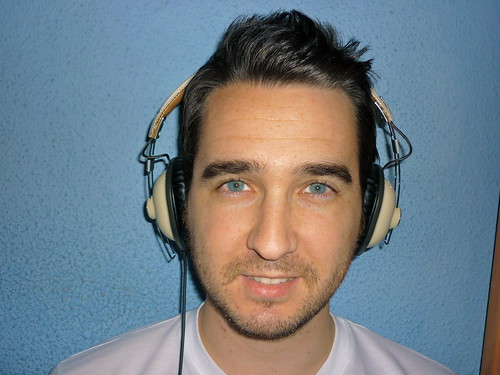

Vuelvo con las entrevistas en el blog. Y es que me encanta esto de preguntar y que los demás respondan. Parece que en mi anterior vida fui periodista y está saliendo a la luz poco a poco. En esta ocasión, conforme habréis imaginado por el título, tenemos a @alvaroprb (del blog [Save the Geek](http://www.savethegeek.es/)) para someterse a un tercer grado. Y como digo, **es el entrevistador entrevistado**, ya que el tema de las entrevistas me volvió a la memoria tras ver en el suyo las [twittervistas](http://www.savethegeek.es/category/twittervista/), como él las llama. Que son entrevistas que se limitan las respuestas en 140 caracteres como en Twitter.

Para hacer una breve introducción, y cogiendo información prestada de su blog, veamos quién es Álvaro:

Mi nombre es Álvaro Paricio, valenciano del 83 y estudiante de ingeniería técnica electrónica. No es mi vocación y no me veo trabajando toda mi vida en nada relacionado con eso pero bueno, algo había que estudiar.

Así que como buen valenciano, sólo por eso, ya sabemos que es un chaval de puta madre, buena gente, amable, afable, bueno, cariñoso, simpático... como cualquier valenciano. :D Presentaciones hechas, vamos allá con la entrevista. **Espero que disfrutéis tanto leyéndola como yo redactando las preguntas y, según me comentó, él respondiéndolas. ¡Todo un honor!**

1Para quienes puedan conocerte menos, ¿cómo eres? defínete en una frase.

Empezamos con una difícil.. a ver. Diría de mi que soy una persona amante de la tecnología y de internet, impaciente por tener siempre lo último, optimista y muy alegre.

2¿Cómo te dio por empezar con Save the Geek? ¿alguna inspiración?

Siempre he tenido la idea de hacer un blog personal, ya hice un intento hace un año o así. Pero no fue hasta este verano que estuve en la Campus Party (gracias a una entrada gratis que me tocó en Pixel y Dixel). Allí asistí a varias charlas sobre blogs y me marcaron especialmente las de Fernando Tellado de Ayuda Wordpress y la de David Alayón de Pisito en Madrid. No es que sólo me hiciera el blog gracias a ellas pero si me animaron a dar el paso de nuevo pero bien dado, haciendo las cosas bien. Sobre el tema estaba claro que lo iba a hacer sobre mis aficiones e inquietudes geeks. De eso no tenía duda lo más complicado fue escoger el nombre.

3¿Anteriormente a Save the Geek has participado o tenido algún otro blog de tu propiedad?

Ya tuve un primer contacto con los blogs gratuitos de Blogger anteriormente a Save The Geek. Escribía en un blog sobre World of Warcraft, al que antes jugaba. Pero no estaba muy enterado y sabía lo básico, simplemente escribía. No sabía nada de como ver las estadísticas, ni FeedBurner, ni como modificar el blog...

4Aunque ya sé que ahora estás parado, ¿a qué se dedica/dedicaba realmente Álvaro?

Técnicamente no estoy parado ya que estoy acabando mi carrera, así que ahora mismo soy estudiante. Hace unos meses por fin descubrí a lo que realmente me quiero dedicar en esta vida y no tiene nada que ver con lo que he estudiado, me dio un poco de rabia la verdad. A lo que me quiero dedicar es al mundo del Social Media. Terreno donde me muevo bien y creo que podría aportar mucho. Estoy intentando abrirme paso ¡pero no es nada fácil!

5¿Qué consejo le darías a la gente que pueda estar leyéndote y esté planteándose si abrir un blog o no?

Siempre le recomendaría a alguien con inquietudes de cualquier tipo y con ganas de escribir que se abra un blog. Ya sea como una especie de diario, de sitio donde desahogarse o para poder compartir con los demás sus experiencias e inquietudes. Escribir en un blog por placer es una gozada para mi, como una terapia. El empezar a escribir y sacar las ideas que tienes en la cabeza es algo que me encanta. Y si encima ya ves que poco a poco te sigue gente y les gusta lo que escribes, la sensación que se te queda dentro es increíble. Así que sí, recomiendo a todo el mundo que tenga esa duda sobre si abrir un blog o no que lo haga :-)

6¿Blog variados personales o monotemáticos profesionales?

Yo creo que en los blogs hay dos casos muy diferenciados, los profesionales y el resto. No considero mejor a ninguno de los dos, cada estilo tiene sus formas y su público. Personalmente en los blogs personales me gusta ver que se centran sobre varios temas, tampoco muchos. Sitios donde siempre se habla de lo mismo pueden ser más cansados de leer a la larga. Por ejemplo en tu blog unos días comentas las últimas películas que has visto, otro día hablas sobre deporte, temas de internet… Se nota que son cosas que te apasionan y eso lo es todo. En los profesionales ahí ya todo vale, pero normalmente suelen ser sobre el mismo tema así que no se puede elegir mucho.

7¿Cuál ha sido, por ahora, tu mejor compra tecnológica?

Yo diría que el iPhone. El iPhone en sí, porque he tenido el primero modelo que sólo salió en Estados Unidos y ahora el 3GS. El MacBook está ahí ahí en cuanto a la mejor compra pero realmente el iPhone me ha aportado muchísimas cosas. Sobre todo el 3GS con el que por fin pude disfrutar de la tarifa plana de datos y estar conectado a internet en todo momento. Es algo que ha cambiado mi vida en varios aspectos y de lo que me alegro muchísimo. Y ya que estamos te contaré la peor: el Mighty Mouse. La peor compra tecnológica de mi vida con diferencia. Maldigo al que se le ocurrió lo de la bolita, de lo peor que he visto en cuanto a usabilidad.

8Si tuvieras que inventar, patentar y crear tu propio gadget, ¿cuál sería y qué funciones tendría?

Difícil pregunta… tendría que ser algún tipo de gadget del estilo todo en uno. Que tuviera internet, llamadas, para leer eBooks… Algo parecido a un iPad pero con funciones de teléfono. Aunque la verdad que no es lo mío esto de pensar en nuevos gadgets, por suerte y como buen fan (que no fanboy) de Apple que soy siempre se inventan cosas que me alucinan.

9¿Correo electrónico o correo postal?

Correo electrónico sin dudas. Sobre todo por la inmediatez. Es cierto que el correo postal era muy diferente, la sensación de recibir una carta escrita a mano por alguien era genial y a veces se echa de menos, aunque siempre podemos aprovechar las Navidades para mandar las típicas felicitaciones y rememorar esos momentos en que recibíamos cartas más a menudo. Pero vamos, que para mi el correo electrónico es indispensable (bueno, para todos claro) y no tengo dudas sobre cual elegiría si me dieran la opción.

10¿Qué se preguntaría Álvaro si tuviera que hacerse una pregunta a sí mismo?

Pues si yo pudiera auto entrevistarme seguro que me haría varias de las preguntas que me has hecho, pero habría una que seguro que me haría y para la que no sé si tengo respuesta, sería: ¿Cuál es tu objetivo con el blog, hasta dónde quieres llegar? Me sería una pregunta muy difícil de contestar, pero por lo pronto tengo un gran objetivo con mi blog y es llegar a cumplir un año escribiendo en él. Si puede ser como hasta ahora, con cinco posts a la semana o si no con alguno menos, pero cumplir un año me haría muchísima ilusión :-) Lo que venga después de eso la verdad es que no lo sé y me encanta esa sensación.

Hasta aquí la entrevista. Al igual que me pasó con [la anterior entrevista](http://fjp.es/entrevistando-a-franjuice/), de @FranJuice, también me encanta que las respuestas sean extensas y no se limiten a responder vagamente con los mínimos caracteres posibles. Que ya que no hay restricciones de ese tipo, y escribir nos sale gratis, ¿qué mejor que aprovecharlos para explicarse bien, no?

Lo dicho, me ha encantado entrevistar a entrevistador, o twittervistador. :D
