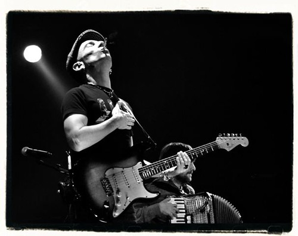

  
fotografía de [Jon Iraundegi](http://www.flickr.com/photos/joniraundegi/4210046224/)

Hace tiempo que llevo observando las variaciones que va tomando el panorama musical español. Pero ya no solamente éste, si no también el panorama musical mundial. **Hace unos años los autores, artistas y músicos no contemplaban la idea de comercializar su música si no es haciéndose valer de una productora** que ejerciera de intermediario y que, a su vez, se llevara buena parte del dinero obtenido. **Ésta, a su vez, tampoco concebía un modelo de negocio musical donde parte del pastel no se lo llevara la Sociedad General de Autores** —más conocida como la mafia del Rey del Pollo Frito y su abu, Teddy Bautista—.

Bien, no hará ni una semana desde que leía con atención un artículo del blog Pixel y Dixel donde confirmaban que [la música en directo no está en crisis](http://www.pixelydixel.com/2010/02/la-musica-en-directo-no-esta-en-crisis.html). Éste, a su vez, venía referido de [un artículo de Europa Press donde señalaban la noticia](http://www.europapress.es/cultura/musica-00129/noticia-musica-directo-no-crisis-20100223164101.html), esa noticia que no fue portada de ningún medio y que jamás lo será, porque ese tipo de noticias no venden. Lo que sí que vende es saber cómo [Rosario Flores lo pasa mal, muy mal, fatal](http://mangasverdes.es/2009/12/05/rosario-muere-hambre-lentamente/), debido a que los piratillas bajamos su música de Internet y no compramos sus discos. Pues mira señora, hija/hermana de... **Si pasas hambre es porque tu trabajo deja mucho que desear**, no porque lo descarguemos de Internet. A mí, al menos, ni se me ocurriría.

No fue hasta leer [el artículo sobre el Canon Digital](http://blogdebori.com/2010/02/26/opinion-sobre-el-canon-digital/) del otro día de @BlogdeBori hasta que me animé a publicar esto. Y justo ese mismo día, también leo este otro interesante artículo de mi paisano carlos63 donde hace [una comparación entre la industria del porno y la industria musical](http://carlos63ccp.blogspot.com/2010/02/porno.html).

Y es que todos estos vividores del negocio musical no pueden estar más errados. Y digo bien, **vividores del negocio musical**; porque ninguno de todos ellos debería considerarse autor, músico o artista... desde luego, no lo son. **No se puede ser un artista cuando la máxima meta que tienes es sacar un disco con una canción medianamente aceptable y que las demás sean pura bazofia** y querer estar viviendo de él y de sus derechos de autor cinco años. ¿Y qué se hace cuando se acaba el fuelle a esto? Pues sacamos un **The very best of...** y así renovamos un poco la caratula del disco y volvemos a forrarnos con los derechos de autor sin haber dado palo al agua.

**Los artistas, compositores y músicos de verdad están dejándose la piel en los conciertos**. Aumentan con cada año la duración de sus giras promocionales. Cada vez recorren más ciudades o países para dar a conocer su música... y esta de esta forma como realmente se gana dinero; **no quedándose en casa tocándose las partes nobles de cada cual mirando a ver si le llaman de algún programa de televisión para contar cómo le va la vida, y así poder seguir forrándose a costa de no dar palo al agua**. Esa gente está peleando con uñas y dientes para que se les reconozca, y estén en el puesto donde deberían estar. En lo más alto, y por méritos propios. **No como otros vividores del negocio musical que dicen estar ahí por méritos propios y solamente están, y esto lo sabemos todos, porque vienen de una conocida herencia familiar a la que nadie se atreve a negar ese puesto**. ¿Por méritos propios? ¡un cuerno!

Grupos musicales como [La Musicalité](http://www.lamusicalite.es/) (en este último álbum) están aprendiendo que las discográficas no son todo, ni las productoras musicales. **Para el álbum 4 elementos han sido ellos mismos sus propios productores musicales**: sin intermediarios ni nadie que se lleve parte del pastel. **Y les ha salido un disco estupendo**. Llegando el dinero íntegramente a sus autores, no quedándose en el medio para que unos cuantos buitres de carroña se forren tanto a costa de los autores como a costa nuestra.

Y cuando nombro buitres carroñeros no puedo referirme a otros mas que a los que cité al principio, la SGA€. Y no hay mas que ver como **unos cuantos parásitos musicales están forrándose gracias a los demás y sin dar palo al agua**. Véase el Rey del Pollo Frito o Teddy Bautista, que con un enorme pesar para él [no creo que llegue fácilmente a fin de mes cobrando 24500€ mensuales de pensión](http://www.larazon.es/noticia/5530-el-pensionazo-de-teddy-bautista-24-500-euros-al-mes). ¡Qué desfachatez! Una persona como él, que tanto de bueno ha dado a la música, y sigue dándolo... ¡qué menos que cobran 30000€ mensuales, qué menos!

¿Queréis vivir de la música? **¡Me parece perfecto! Pero currad como hacemos los demás, vagos de los cojones**. ¡Vividores!
