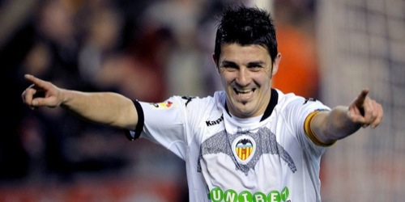

Aunque cuando escribo esto David Villa ya no es jugador del Valencia CF, mas que me pese, **no quiero recordarlo con el tiempo con otra camiseta que no sea la de mi Valencia**, así que por eso la foto que encabeza ésto hará de recordatorio incluso de los partidos donde ha podido lucir el brazalete de capitán (que por cierto, ya veremos si vuelve a lucirlo en otro equipo alguna vez).

Me pasó lo mismo con Predrag Mijatovic, lo mismo con Claudio López, no fue menos con Gaizka Mendieta y no podía ser de otra forma, lo mismo con David Villa. Y **gracias que no tengo más años para haber podido vivir más decepciones futbolísticas** con jugadores más veteranos. Y es que hace mucho tiempo que aprendí que **lo que importa es el club, los colores, el escudo, y lo que para mí representa**; que los jugadores vienen y van, pero como ser humano que soy me es imposible no coger cierto cariño a personas de las que sabes noticias prácticamente a diario, con las que te ilusionas, con las que disfrutas en los buenos momentos y lo pasas mal en los malos momentos, y en definitiva, personas que llevas _conociendo_ bastantes años. Y es que cuando un jugador como David Villa, o los citados anteriormente, se van del club del cual eres seguidor... dejan un vacío tremendo.

David, después de cinco años te hablaré con confianza, tras tantas decepciones las camisetas no volví a serigrafiármelas. Me prometí que no cometería el mismo error más veces, pero sepas que si hubiera llegado nuevo al fútbol en el año 2005, tu nombre y dorsal hubieran ido directamente serigrafiados en la próxima camiseta que me hubiera comprado. Ahora mismo no puedo verte como te veía hace unas semanas atrás, pese a que desde la temporada pasada sabía que era cuestión de tiempo que te marcharas del club, pero sepas que no te guardo rencor alguno porque sé que no te has ido por decisión propia, si no por una decisión forzada. Y es que cuando no se hacen las cosas bien en un club, pasa lo que pasa, y lo que está pasando ahora es que si no queremos irnos a la ruina nos toca vender parte del patrimonio que tenemos. O al menos, del patrimonio que tenemos, vender esa ínfima parte por la que alguien pueda estar interesado... y tú, claramente, eres el primer eslabón de la cadena. Sinceramente, espero que algún día vuelvas a este club. Sea como consejero, como entrenador, como Presidente, o como los azares de la vida decidan que debieses volver; seguro que lo harías genial, tan bien como lo has hecho como futbolista estos cinco años que has estado con nosotros, a nuestro lado, y dándonos alegría tras alegría. Además, en caso de que llegaras como Presidente seguro que peor que Manuel Llorente no ibas a hacerlo, así que ya tendrías algo ganado.

Y hablando de Manuel Llorente, y como viene siendo costumbre, me permitiré dedicarle unas palabras a este ser nauseabundo que tanto daño está haciendo al Valencia y al valencianismo. Esta marioneta de Bancaja que ha conseguido en una misma semana [no renovarle el contrato a Rubén Baraja](http://fjp.es/quan-arriba-la-nit-encara-soc-baraja/), **ganándose con ello a pulso la antipatía de gran parte del valencianismo, y para ganarse la antipatía del resto no se le ocurre nada más que vender a Villa al Barça por 40 millones (cantidad escandalosamente escandalosa donde las haya). Y encima ocultándolo hasta cuando no se podía ocultar más. Engañándonos desde el año pasado haciéndonos creer que no iba a venderse para que nos gastásemos los pocos ahorros que teníamos en unas acciones que no van a servir para nada ya que la mayoría accionarial sigue siendo de los mismos a base de trampas, chanchullos y malas artes**. Si de verdad el Valencia debe pagarle a este ser hipócrita y mezquino 28000€ al mes para que haga lo que está haciendo (y ojo, que ya ha dicho que puede que no sea la última salida de la temporada), de verdad, que alguien me ofrezca el puesto que para hacer eso mismo yo con 2000€ lo hago. **Y con el resto podemos devolverles el trabajo a los utilleros del equipo filial que se despidieron por no disponer de suficiente dinero para pagar sus nóminas. Muchos de ellos, gente de edad avanzada que no pasaban de los 500€ al mes**. ¡Magnífico Llorente, ejemplar! Y luego decimos de Soler... que no seré yo quien le defienda, pero como dice el refrán: _otros vendrán que bueno te harán_.

De nuevo, David, **te deseo la mejor de las suertes con tu nuevo equipo. Eso sí, siempre que el equipo contra el que tengas que tener suerte no sea el Valencia**. ;) ¡Hasta pronto!
