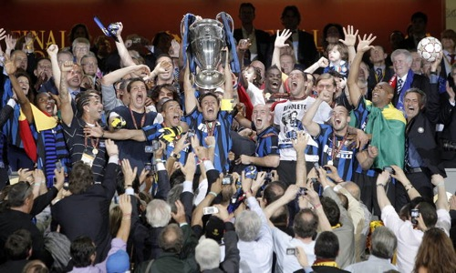

Tenía ganas de ver este partido. Sobre todo, y para ser sinceros, de lo que más ganas tenía era de que ganara el Inter; solamente por ver la cara de los jugadores y aficionados del Bayern de Múnich tras haber quedado segundos. Algo como lo que nos sucedió nosotros en una fecha que todavía recuerdo: 23/05/2001. Dicen que el fútbol es justo... realmente pienso que muchas veces no lo es, pero creo que esta vez ha puesto a cada uno en su lugar.

**FORZA INTER!**
