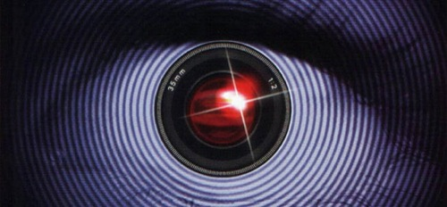

Pues sí, la décimo primera edición de Gran Hermando se ha terminado. **Ángel, el ganador**. De entre los finalistas, diría que mereció ganar. Aunque no tanto si contamos todos los concursantes, que bien por un motivo u otro el público que vota estimó que no deberían haber ganado.

**La edición de los récords** la bautizaron: fue en **la que más concursantes participaron**, **en la que más _repescas_ hubo**, la única en la que **como concursantes entraron a la casa una madre y una hija**, y también, **la primera en la que dos miembros de una unidad familiar votaban por separado** y no como una única persona; fue **la edición más longeva**, y quizá directamente proporcional a ésto fueron **el número de reglas quebrantadas**. Y por si todo lo anteriormente citado parece poco, es **la única edición del mundo en que uno de los finalistas no ha sido nominado** en todo el programa.

Y pese a todos los récords que ostenta, que no son pocos, siempre a mi modo de ver **creo que es una de esas ediciones que _pasará sin pena ni gloria_**. Que, siendo benevolente, auguro que quedará en nuestra memoria hasta que la siguiente edición dé comienzo. No más. En todo caso, y quizá ni eso, será recordada por la edición en que unas gallegas que, entonces, ni recordaremos cómo se llamaban, cantaban una canción muy moñas siempre que tenían algo que celebrar... o porque les daba la gana, sin motivo aparente. Como un acto de posesión incontrolable.

Esta edición **no ha tenido un Ismael Beiro**, no ha tenido **tampoco ningún Iván Armesto ni ningún Iñigo González** que recordar; **menos aún ha tenido un Iván Madrazo** y, **ni por asomo, un Pepe Herrero**. **Ninguna Beatriz González** a la que poder imitar, ni **ningún Nicky Villanueva** al que recordar cuando, efusivo, solicitaba _los papeles de la paella_. Tampoco tuvo alguien como el emblemático **Jorge Berrocal**, que aunque un poco llorón (a mi parecer), se ganó la simpatía del público... Y tantos otros que seguramente me dejaré. Y quizá, los que más _caña_ podían habernos dado, han sido los que, injustamente o no, no han podido llegar a la final. Cosas de la vida.

**Quizá la máxima protagonista de esta edición**, siendo que en un programa de esta índole debería ser lo último que llegara a suceder, **haya sido su presentadora: Mercedes Milá**. Que no como en otras ocasiones, haciendo gala de sus buenas dotes como periodista y comunicadora, **nos ha deleitado esta vez con un favoritismo y una mala educación que roza la sinvergonzonería**.

La casa se ha quedado vacía en espera de la próxima edición. Hasta la vista.
