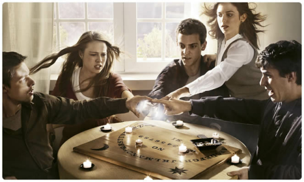

Aunque ya hace tiempo que terminó la serie, como he estado bastante desconectado no he tenido la oportunidad de hacer comentarios sobre ella. Y además, también sirve de título de anuncio de regreso, o al menos de intento de...

Cierto es que desde hace más de un mes desaparecí sin dejar rastro aparente. Aunque por Twitter seguí estando un poco (pero poco), quienes me seguís en Facebook realmente sólo me habréis visto desaparecido algo más de una semana. Y muchos lo sabréis, pero quienes no lo sepáis, os cuento que he estado de mudanza. Durante estos días no he visto mas que cajas de cartón y cinta de embalar. Peso y más peso cargando la hoy ya maltrecha espalda que se resiente en un costado y lleva ya días molestando...

En fin, que me pongo melodramático. Mientras escucho música del Spotify social recuerdo la serie Hay alguien ahí. Y de cómo terminó teniendo audiencia pese a las ganas de Cuatro de que la perdiera. Emitiéndola a unos horarios intempestivos en días laborables donde la gente debe madrugar. Pero es lo que hay, cuando una cadena, sea por lo que sea, decide llevar a pique una serie y no dar paso a una tercera temporada... vaya si lo consigue. Lo que más me jode es que días más tarde de anunciar su final y que no habrán nuevas temporadas se jactan en una noticia en la web de Cuatro y en Facebook diciendo que uno de los spots en los que se anunciaba la tercera segunda temporada ha ganado un premio... ¿después de como les habéis tratado...? Seguramente habrán cosas detrás de todos esos cambios de horarios, anticipo del fin, todo apresurado... todo eso que quienes seguíamos la serie sabemos... que no se lleguen a saber jamás, pero vaya tela... Una serie española buena, o que al menos a mí me lo parecía, la terminan así... ¡Y después quieren que nos decidamos por las producciones españolas...! ¿Cómo? Actuando de la forma tan _made in Spain_ que nos caracteriza... Una serie excelente con una gestión paupérrima por parte de Cuatro. Qué vamos a hacerle, todo no podía ser perfecto.

Y eso... Que si hay alguien ahí todavía: ¡hola de nuevo! Espero que poco a poco siga con la marcha que tenía antes. Aunque ya se sabe que tras un parón tan largo hay una pereza enorme... xD

¡Hasta pronto!
