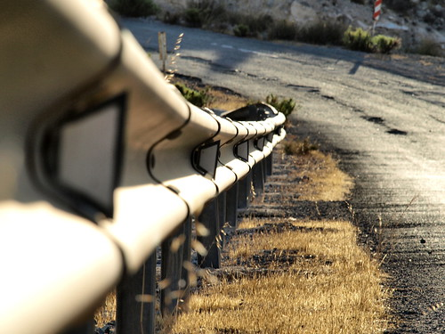

  
Fotografía de [Javi SLH](http://www.flickr.com/photos/mofo_101/) en Flickr

Las seis y cincuenta y ocho de la mañana. Quedan dos minutos para que suene el despertador. Maldito trabajo, todos los días lo mismo. Me doy la vuelta en la cama. Ahora le doy la espalda al armario, y tengo a la altura de mis ojos su nuca. Es blanca, bonita. El pelo recién cortado y lavado, como se encargó de recordarme Javi ayer por la tarde justo antes de que su madre llegara. Levanto la mano derecha hasta la altura de su hombro y recorro, casi sin tocarla, todo su contorno. Le acaricio el pecho, sigo por el abdomen, su barriguita, la cadera y los muslos. Se estremece. La quiero con toda mi alma. Las seis y cincuenta y nueve. Me vuelvo a girar, pero esta vez es hacia el maldito demonio que me arranca cada mañana de su lado. Laura te quiero.

Me siento en la cama, y pienso en todo lo que tengo que hacer hoy. Me siento abrumado. Primeros de mes. Toca pagar todo lo pagable. Hipoteca, recibos de luz, agua, gas, seguros del coche, crédito de coche y, por fin, el último de la moto. Cinco años pagando moto pero hoy es mía. Un cero, un siete, un cero, un cero. Esos dígitos rojos, que solo pueden venir del infierno, me abrasan la mente, y me recuerdan que dentro de cuarenta minutos tengo que salir hacia el trabajo. Busco las zapatillas a tientas. Una está debajo de la alfombra, y la otra aparece en el lado de Laura; ¿como habrá llegado hasta ahí? Una de esas preguntas que nunca se podrán responder. Me sonrío por las chorradas que se me ocurren a estas horas.

Salgo del dormitorio, y me acerco a la leonera. Javi y Laura siguen dormidos. Siete y once años. Me siento feliz, y sé que soy afortunado por tener a mi lado mis razones para vivir. En el cuarto de baño aún están por el suelo las toallas de la lucha nocturna para duchar a Javi. Está en la época, decía la psicóloga del colegio. Las recojo, y las pongo en la ropa sucia. El agua caliente revive mis músculos, y empiezo a sentirme capaz de actuar como un humano. Me preparo unas tostadas y un café Express, que el tiempo ya me pisa los talones. Me pongo las botas de invierno que ya hace fresco, las de 150 euros. Me pongo la espaldera que me regaló Laura por mi cumpleaños, desde que me hizo ese regalo no hay moto sin espaldera Halvarssons Safety; -una buena, de las caras- me dijo, después de abrir el regalo, Javi. Por lo visto acompañó a su madre. La chaqueta de cordura con su forro interior abriga lo suficiente como para que solo lleve debajo un jersey normalito. La chaqueta no es de las mejores pero tiene sus protecciones: 200 euros. Ya estoy casi listo. Cojo el casco, los guantes y solo tengo tiempo de una despedida rápida, unos besos fugaces y hasta la noche.

En el garaje termino de equiparme. Me pongo el chaleco reflectante porque a esta hora todavía es de noche. Me pongo el casco de 450 euros, y los guantes de 120 que, a pesar de ser de invierno, me dejan los dedos fresquitos, fresquitos. Ahora empieza lo mejor del día hasta la vuelta a casa. Arranco la moto, y me saluda con una tos. "Chica, que hoy ya eres libre". Ánimo. Lo intento una segunda vez, y ahora sí. Ya se ha despertado, y estamos listos para la lucha.

Primera, y la moto se desliza sobre el pulidísimo piso del aparcamiento subterráneo. Cualquier día va a patinar, y me la voy a pegar. ¿Por qué no harán estos suelos antideslizantes? En la calle hace un frío que pela. Giro a la derecha, y me dirijo a la primera rotonda. Esta noche la han regado, y el chorrito diabólico parece que no quería limitarse al césped y ha mojado todo el contorno de la rotonda. Paso a cinco por hora, no sin antes esquivar un coche que se ha saltado el ceda el paso. Casi me embiste. El muy cegato me saluda con el dedito. Pobre. Ahora tocan los Puertos de Montaña. Son seis para salir de la urbanización. Todos pintados de rojo, y blanco. Preciosos, muy coquetos. Para subirlos y no matarme tengo que pasar a diez por hora en zona de cincuenta. Cada vez que paso por ellos recuerdo cuando me patinó la rueda, y me rompí el brazo. El ayuntamiento dijo que era por mi falta de pericia. Viene el primero. Suelta gas. Frena. Levanta un poco el culito. Bota. Da gas flojito. Bota. Pobre suspensión. Más gas. Y, así, cinco veces más.

En el Alpe Duez me pasa zumbando un "125". Parece el Batman con la moto, un Batman de esos convalidados. Ahora toca decidir si autovía o nacional. Hoy autovía. Durante diez kilómetros me mantengo a 130 de marcador. Hasta que llego al punto negro. Un tramo recto de unos cuatro kilómetros donde se pasa de limitar la velocidad a 120 a 100, todo ello controlado por un radar. Es zona de frenazos. Peligro. Hoy está la cosa tranquila, o eso parece. Ya estoy cerca del atasco. Los últimos quince kilómetros son así siempre. Coches parados, y las motos por el arcén. Circulo a 20 por hora. Con mil ojos. Me fijo en la rueda directriz derecha de los coches. En como tiene las manos sobre el volante el conductor. En si mira por el retrovisor. Los intermitentes. De repente, una rueda se mueve hacia fuera. Reduzco. Le veo mirar por el retrovisor. Me ha visto. Pero no me fío. Casi voy parado. Se ha cruzado delante de mí. Frenazo, y a duras penas mantengo el equilibrio. ¿Por qué hace eso? ¿A dónde va? Simplemente, es una persona mala. Quería hacerme daño. Mientras recupero el aliento veo por el rabillo del ojo como pasa una moto lanzada por el lado izquierdo del coche asesino, y escucho un ruido de plástico roto. Le han roto el espejo retrovisor. Le miro a su cara y su gesto de burla se transforma en ira, ira impotente. ¿Justicia divina? ¿Inconsciente oportuno?

Tras el susto sigo adelante, y ya parece que se quita el atasco. Empieza a llover. Son chispitas. La chaqueta aguantará sin problemas, solo son diez minutos más. El último curvón hacía la derecha limitado a 80. Voy a sesenta, hay tráfico denso. Un coche me echa de mi carril. Se me ha echado encima, y ni lo he visto. Hago una maniobra brusca. Paso sobre una flecha blanca de pintura antideslizante. Se me va la rueda. No la controlo. Me voy al suelo, me voy al suelo. Escucho chirrido de frenos, y de ruedas arañando el asfalto. El primer golpe es con el hombro derecho. El dolor atraviesa mi mente como un estallido de luz blanca. Doy una vuelta de campana. Veo pasar el suelo delante de mis ojos a cámara lenta, y caigo de espaldas. La espaldera hace su trabajo. El casco va rebotando contra el rugoso asfalto. Me he caído. Sigo pensando. Me duele el hombro, la espalda y la rodilla pero parece que no me he hecho nada mas. Ahora solo tengo que parar. Eso fue lo último que pensé antes de que el soporte vertical de un guardarrail me cortara por la mitad.

Morí en el acto. Pero seguía viéndolo todo. Escuchándolo todo. Sintiéndolo todo. Seguía sintiendo. ¿Y Laura? ¿Y mis niños? ¿Y mi vida? ¿Por qué a mí? ¿Por qué contra un guardarrail? Ha sido un accidente. No debería haberme costado la vida. Pero estoy muerto. Muerto. Muerto. Muerto...

**No dejéis de luchar porque un guardarrail asesino cambiado por uno protegido puede salvar una vida. Lucha por la vida. Lucha por tu vida. Lucha por nuestra vida.**

V's
